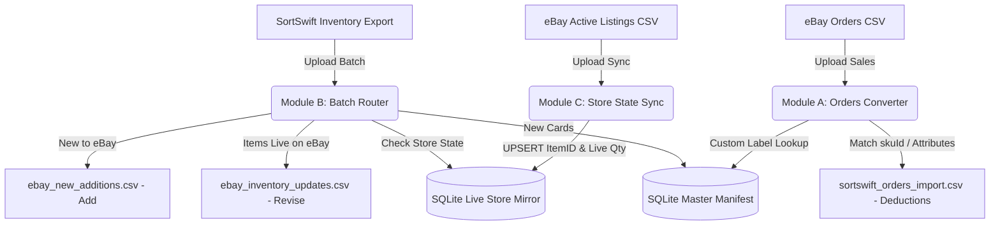

# TCG Card Inventory Middleware (SortSwift &harr; eBay Bridge)

A lightweight, containerized Python web application and standalone core library designed to run on a **Synology NAS** (via Docker / Container Manager) and developable directly on **Windows**.

This middleware connects **SortSwift** (TCGplayer Inventory Schema) and **eBay Seller Hub Reports**. It automates stock deductions, synchronizes single/variation listings, and bypasses eBay's 50-character SKU limit using an atomic SQLite database and compact sequential manifest IDs (`ID1001`, `ID1002`, ...).

---

## 📑 System Architecture & Workflow



---

## 🐳 Synology NAS Deployment Guide

### 1. Requirements on Synology NAS
* Synology DSM 7.2+ with **Container Manager** (or Docker on DSM 7.0/7.1).
* SSH or File Station access.

### 2. Deployment Steps via Docker Compose
1. Create a directory on your NAS for persistent data:
   ```bash
   mkdir -p /volume1/docker/tcg-middleware/data
   chmod -R 777 /volume1/docker/tcg-middleware/data
   ```
2. On your local machine, push your changes to GitHub:
   ```bash
   git add .
   git commit -m "Deploy latest changes"
   git push origin main
   ```
3. On your Synology NAS (via SSH or Container Manager Web UI):
   ```bash
   cd /volume1/docker/tcg-middleware
   git pull origin main
   docker-compose up -d --build
   ```
4. Access the web dashboard at: `http://<YOUR_SYNOLOGY_IP>:8080` (or whichever `HOST_PORT` you assigned).

### 3. Avoiding Port Conflicts on Synology
If port `8080` is already used by another container on your NAS, set `HOST_PORT` in your `.env` file or environment variables:
```bash
HOST_PORT=8088
```
Then run `docker-compose up -d`. The container will map host port `8088` to container internal port `8080`.

---

## 💻 Windows Local Development & Testing Cycle

You can develop, run, and test **100% of this application locally on Windows** before deploying to your NAS.

### 1. Setup Virtual Environment
```powershell
python -m venv .venv
.\.venv\Scripts\Activate.ps1
pip install -r requirements.txt
```

### 2. Run Locally on Windows
```powershell
python app/main.py
```
Open your browser at `http://localhost:8080`.

### 3. Run Automated Tests
```powershell
# Run standalone engine unit tests
python -m unittest discover -s tcg_engine/tests

# Run web app & API integration tests
python -m unittest tests/test_web_app.py
```

---

## 📦 Standalone Core Package (`tcg-engine`) & CLI

The core business logic is packaged as an independent library in [`tcg_engine/`](file:///c:/Users/Mark/Documents/GitHub/SoftSwift-Ebay-CSV-Converter/tcg_engine) with zero web dependencies.

### Running Standalone via CLI:
```powershell
# Initialize SQLite database
python -m tcg_engine.cli init-db --db data/inventory.db

# Module A: Convert eBay Orders CSV to SortSwift Deduction CSV
python -m tcg_engine.cli orders sample_ebay_orders.csv -o sortswift_orders.csv --db data/inventory.db

# Module B: Route SortSwift Batch to eBay Add vs. Revise CSVs
python -m tcg_engine.cli batch sortswift_batch.csv --out-dir ./output --db data/inventory.db

# Module C: Sync Active eBay Listings Report into Store State Mirror
python -m tcg_engine.cli sync active_listings.csv --db data/inventory.db

# Export Master Catalog
python -m tcg_engine.cli export-manifest -o master_manifest.csv --db data/inventory.db
```

---

## 🔐 User Authentication & Admin Approvals

* **First User Auto-Admin**: The very first user who creates an account on your middleware is automatically granted the `admin` role and `active` status.
* **Self-Registration with Admin Approval**: Any subsequent users who register (via username/password or Google Sign-In) will be placed in `pending` status.
* **Admin Control Panel**: Log in as the Admin and click **"Users & Approvals"** in the top navigation bar to approve pending accounts, deactivate users, or promote users to admin with one click.
* **Offline Dev Mode**: To bypass authentication during local Windows development, set `AUTH_METHOD=none` in `.env`.

---

## 💰 Configurable Tiered Pricing Rules

You can configure automated pricing rules for eBay listings directly from the dashboard:
* **Rule Types Supported**:
  1. **Fixed Base Price ($)**: Sets a hard floor price for cards in a market price range (e.g., `< $0.25` &rarr; `$1.99`).
  2. **Market Price + Diff ($)**: Adds a fixed dollar amount to the TCGplayer Market Price (e.g., `>= $1.00` &rarr; `Market Price + $3.00`).
  3. **Market Price + Markup (%)**: Adds a percentage markup to the market price (e.g., `Market Price + 20%`).
* **Default Active Rules**:
  * **$0.00 &ndash; $0.25**: Fixed `$1.99`
  * **$0.25 &ndash; $0.50**: Fixed `$2.49`
  * **$0.50 &ndash; $1.00**: Fixed `$2.99`
  * **$1.00+**: TCGplayer Market Price `+ $3.00`
* **Interactive Calculator**: The Pricing Rules page includes a live test calculator to test any card price and view the computed eBay price in real time.

---

## 🎴 Multi-Item Variation Grouping & Single Listings

You can configure how the middleware splits and titles listings via the **"Listing Rules"** button on the dashboard:
* **Automated Set Grouping**: All cards belonging to the same Expansion Set (e.g., `SV05: Temporal Forces`) are automatically grouped into a single multi-variation drop-down listing on eBay.
* **Single Listing Value Threshold**: Cards whose effective calculated price is **equal to or above $5.00** (or your customized threshold) are automatically split out and created as **standalone Single listings**.
* **Smart 80-Character Title Formatting**:
  * Default Title: `{Set Name}: Pick Your Card - Near Mint - Complete Your Set`
  * **Automatic Fallback**: If the set name is long and causes the title to exceed eBay's 80-character limit, the engine automatically replaces `Near Mint` with `NM` (`{Set Name}: Pick Your Card - NM - Complete Your Set`), ensuring eBay Seller Hub bulk upload never rejects your CSV due to title length.
* **Parent & Child Row Generation**:
  * `ebay_new_additions.csv` automatically produces the official eBay Seller Hub format:
    * **Parent Row**: `Relationship = Variation`, `RelationshipDetails = Card=Name1|Name2|...`, Category `183454` (CCG Individual Cards), Title, Description, and First Card Image.
    * **Child Rows**: `Relationship = Variation`, `RelationshipDetails = Card=Name1`, Price, Quantity, ConditionID (`3000`), CustomLabel (`ID1001-Bin_A12`), and Image.

---

## 🏷️ Physical Bin / Remark Location Encoding

When you export your SortSwift inventory, SortSwift includes your internal notes in the `Remarks` column (e.g., `Bin A-12`, `Box 4`, `TEF-01`):
* **Encoded into eBay Custom Label (SKU)**:
  * When generating `ebay_new_additions.csv` and `ebay_inventory_updates.csv`, the engine automatically formats the SKU as:
    ```
    ID1001-Bin_A-12
    ```
  * When an eBay order comes in, the packing slip prints `ID1001-Bin_A-12`, allowing you to immediately pull the physical card from the exact bin without opening any other software.
* **Auto-Resolves in Deductions**:
  * The orders parser extracts the base `ID1001` and retrieves the exact SortSwift `skuId` to deduct stock accurately.
* **Searchable in Dashboard**:
  * You can search your catalog by bin location (e.g. typing `Bin A-12` in the search box) in the Live Inventory table.

---

## 📊 CSV Schema Specifications

### 1. SortSwift Inventory Export Ingestion (Module B)
* **Input**: Fresh inventory CSV from SortSwift.
* **Fields Read**: `Name`, `Set`, `Condition` (NM, LP, MP, HP, DM), `Printing`, `Quantity`, `SKU Id`, `TCGplayer Id`, `Price`, `Market Price`, `eBay Price`, `CDN Image`.
* **Pricing Fallback**: `eBay Price` &rarr; `Price` &rarr; `Market Price` &rarr; `$0.99`.
* **Output 1 (`ebay_inventory_updates.csv`)**: `Action,Item Number,Custom Label,Quantity,Price` (Revise).
* **Output 2 (`ebay_new_additions.csv`)**: `Action,Category,Title,Description,ConditionID,StartPrice,Quantity,CustomLabel,PicURL,Format,Duration,Price` (Add).

### 2. eBay Orders to SortSwift Deduction Ingestion (Module A)
* **Input**: Raw eBay Orders report (`ebay_orders.csv`).
* **Fields Read**: `Custom Label` (contains `manifest_id`), `Quantity`, `Order Number`.
* **Output (`sortswift_orders_import.csv`)**:
  ```csv
  skuId,productId,Order Number,Product Name,Set Name,Condition,Printing,Quantity
  7805758,542678,ORD-501,Deerling - 016/162,SV05: Temporal Forces,Near Mint,Normal,1
  ```
  *(Matches SortSwift's official ⭐ Recommended `skuId` deduction import specification).*

### 3. eBay Active Listings Sync (Module C)
* **Input**: Official eBay "Active Listings" report.
* **Fields Read**: `Item number`, `Custom label (SKU)`, `Available quantity`.
* **Behavior**: Ignores empty parent rows, extracts variation/single listing item IDs and quantities, and performs atomic UPSERTs into `ebay_variations`.

---

## 🛡️ Persistent Storage on NAS

All master catalog cards, live eBay item links, and user credentials are saved in SQLite database files:
* `/data/inventory.db` &rarr; Catalog & Live Store Mirror
* `/data/users.db` &rarr; User Accounts & Admin Privileges

Because `/data` is mounted to `/volume1/docker/tcg-middleware`, your inventory and credentials remain completely safe across container updates and restarts.
