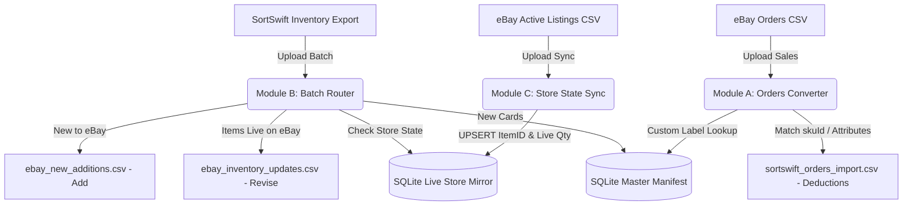

# TCG Card Inventory Middleware (SortSwift &harr; eBay Bridge)

A lightweight, containerized Python web application and standalone core library designed to run on a **Synology NAS** (via Docker / Container Manager) and developable directly on **Windows**.

This middleware connects **SortSwift** (TCGplayer Inventory Schema) and **eBay Seller Hub Reports**. It automates stock deductions, synchronizes single/variation listings, and bypasses eBay's 50-character SKU limit using an atomic SQLite database and compact sequential manifest IDs (`ID1001`, `ID1002`, ...).

---

## 📑 System Architecture & Workflow



---

## 🔐 Authentication: Google Sign-In Only

This application authenticates **exclusively through Google Sign-In**. There is no local username/password login and no development bypass, so there is exactly one way to become an authenticated user.

* **First User Auto-Admin**: The very first Google account to sign in is automatically granted the `admin` role and `active` status.
* **Admin Approval Required**: Every subsequent account lands in `pending` status and cannot process inventory until an admin approves it.
* **Admin Control Panel**: Sign in as the admin and click **"Users & Approvals"** in the top navigation bar to approve pending accounts, deactivate users, or promote users to admin.
* **Stable Identity**: Accounts are keyed on the Google `sub` claim, not the email address, so a user changing their Google email keeps the same local account and approval state.
* **`GOOGLE_CLIENT_ID` is required.** The app refuses to start without it rather than booting into a state where nobody can sign in.

### ⚠️ Google will not authorize a bare LAN address

Google requires OAuth JavaScript origins to use **HTTPS** and **rejects raw IP addresses**. The only exception is `localhost`. That means:

| Origin | Allowed? |
|---|---|
| `http://192.168.1.50:8080` | ❌ Never — raw IP and plain HTTP |
| `http://tcg.local:8080` | ❌ Plain HTTP, non-localhost |
| `http://localhost:8080` | ✅ The one plain-HTTP exception |
| `https://yourname.synology.me` | ✅ Recommended for the NAS |

So reaching the dashboard on your NAS requires an HTTPS hostname in front of the container. The setup is walked through below.

### Step 1 — Create the Google OAuth client

1. Go to <https://console.cloud.google.com> and create or select a project.
2. **APIs & Services → OAuth consent screen** → User type **External**. Fill in the app name, user-support email and developer contact.
3. Add only the `openid`, `email` and `profile` scopes. These are non-sensitive, so Google does **not** require app verification.
4. Click **Publish app**. If you leave the app in *Testing*, only accounts listed under **Test users** can sign in.
5. **APIs & Services → Credentials → Create Credentials → OAuth client ID** → Application type **Web application**.
6. Under **Authorized JavaScript origins**, add both:
   * `https://yourname.synology.me` — production
   * `http://localhost:8080` — Windows development
7. Leave **Authorized redirect URIs empty.** The Google Identity Services button returns the credential via `postMessage`, not an HTTP redirect.
8. Copy the **Client ID** (it looks like `1234567890-abc123.apps.googleusercontent.com`) into your `.env`:
   ```bash
   GOOGLE_CLIENT_ID=1234567890-abc123.apps.googleusercontent.com
   ```
   There is **no client secret** in this flow. The Client ID alone is sufficient and is safe to expose in the browser.
9. Origin changes can take anywhere from 5 minutes to a few hours to propagate.

### Step 2 — Put HTTPS in front of the container (Synology)

1. **Control Panel → External Access → DDNS** → add a Synology-provided hostname such as `yourname.synology.me`.
2. **Control Panel → Security → Certificate → Add** → *Get a certificate from Let's Encrypt* for that hostname. Ports 80/443 must be reachable from the internet for issuance and automatic renewal.
3. **Control Panel → Login Portal → Advanced → Reverse Proxy** → create a rule:
   * Source: `https` / `yourname.synology.me` / port `443`
   * Destination: `http` / `localhost` / port `8080`
4. Keep `COOKIE_SECURE=true` in the NAS `.env`. DSM terminates TLS; the container continues to serve plain HTTP internally on `8080`.

---

## 🐳 Synology NAS Deployment Guide

### 1. Requirements on Synology NAS
* Synology DSM 7.2+ with **Container Manager** (or Docker on DSM 7.0/7.1).
* SSH or File Station access.
* An HTTPS hostname reachable by your browser (see Step 2 above).

### 2. Deployment Steps via Docker Compose
1. Create a directory on your NAS for persistent data:
   ```bash
   mkdir -p /volume1/docker/tcg-middleware/data
   chmod -R 777 /volume1/docker/tcg-middleware/data
   ```
2. On your local machine, push your changes to GitHub:
   ```bash
   git add .
   git commit -m "Deploy latest changes"
   git push origin main
   ```
3. On your Synology NAS (via SSH or Container Manager Web UI):
   ```bash
   cd /volume1/docker/tcg-middleware
   git pull origin main
   docker-compose up -d --build
   ```
4. Access the dashboard at `https://yourname.synology.me`.

`docker-compose` will refuse to start if `GOOGLE_CLIENT_ID` is not set in the environment or `.env`.

### 3. Avoiding Port Conflicts on Synology
If port `8080` is already used by another container on your NAS, set `HOST_PORT` in your `.env`:
```bash
HOST_PORT=8088
```
The container maps host port `8088` to container internal port `8080`. Point the reverse-proxy destination at whichever host port you chose.

### 4. Health Checks
The container exposes an unauthenticated probe at `/api/health`, which also verifies the SQLite volume is reachable and returns `503` if it is not. A Docker `HEALTHCHECK` is wired to it, so Container Manager shows the container as healthy or unhealthy rather than merely running.

---

## 💻 Windows Local Development & Testing Cycle

### 1. Setup Virtual Environment
```powershell
python -m venv .venv
.\.venv\Scripts\Activate.ps1
pip install -r requirements.txt
```

### 2. Configure `.env`
Copy `.env.example` to `.env`, then set your Client ID and relax the cookie flag for plain HTTP:
```bash
GOOGLE_CLIENT_ID=<your-id>.apps.googleusercontent.com
COOKIE_SECURE=false
```
Make sure `http://localhost:8080` is registered as an authorized JavaScript origin.

### 3. Run Locally on Windows
```powershell
python app/main.py
```
Open `http://localhost:8080`. Browsing via `http://127.0.0.1:8080` also works, but whichever form you use must match an authorized origin exactly.

### 4. Run Automated Tests
```powershell
# Run standalone engine unit tests
python -m unittest discover -s tcg_engine/tests

# Run web app & API integration tests
python -m unittest tests/test_web_app.py
```
The web tests stub Google token verification, so they need no network access and no real credentials.

---

## 📦 Standalone Core Package (`tcg-engine`) & CLI

The core business logic is packaged as an independent library in [`tcg_engine/`](./tcg_engine) with zero web dependencies.

### Running Standalone via CLI:
```powershell
# Initialize SQLite database
python -m tcg_engine.cli init-db --db data/inventory.db

# Module A: Convert eBay Orders CSV to SortSwift Deduction CSV
python -m tcg_engine.cli orders sample_ebay_orders.csv -o sortswift_orders.csv --db data/inventory.db

# Module B: Route SortSwift Batch to eBay Add vs. Revise CSVs
python -m tcg_engine.cli batch sortswift_batch.csv --out-dir ./output --db data/inventory.db

# Module B: Re-apply a batch that has already been processed (adds quantities again)
python -m tcg_engine.cli batch sortswift_batch.csv --out-dir ./output --force --db data/inventory.db

# Module C: Sync Active eBay Listings Report into Store State Mirror
python -m tcg_engine.cli sync active_listings.csv --db data/inventory.db

# Export Master Catalog
python -m tcg_engine.cli export-manifest -o master_manifest.csv --db data/inventory.db
```

---

## 💰 Configurable Tiered Pricing Rules

Pricing is driven entirely by the rules stored in the `pricing_rules` table, which you edit from the **Pricing Rules** screen on the dashboard. **The database is the source of truth** — the figures below are only the defaults the app ships with, and they stop being accurate the moment you edit a tier.

* **Rule Types Supported**:
  1. **Fixed Base Price ($)** (`fixed`) — the card is listed at a flat price, ignoring its market value.
  2. **Market Price + Diff ($)** (`markup_fixed`) — adds a fixed dollar amount to the base price.
  3. **Market Price + Markup (%)** (`markup_percent`) — adds a percentage markup to the base price.
* **Shipped Default Rules**:

  | Base price range | Rule | Result |
  |---|---|---|
  | `$0.00` – `$0.25` | `fixed` 1.99 | `$1.99` |
  | `$0.25` – `$0.50` | `fixed` 2.49 | `$2.49` |
  | `$0.50` – `$1.00` | `fixed` 2.99 | `$2.99` |
  | `$1.00` and above | `markup_fixed` 3.00 | base `+ $3.00` |

* **Range semantics**: a rule matches when `min_price <= base < max_price`. A rule with an empty `max_price` is open-ended and matches everything at or above its `min_price`.
* **Interactive Calculator**: The Pricing Rules page includes a live test calculator so you can enter any base price and see the computed eBay price immediately.
* **Reset Defaults**: restores exactly the four rules in the table above.

### How the base price is chosen

This is the precedence the engine actually applies, in order:

1. If the row has a non-zero **`eBay Price`** column (`Platform Price (Ebay)`, `eBay Price`, ...), that value is used **verbatim** and the pricing rules are skipped entirely. This lets you override pricing per card from SortSwift.
2. Otherwise the base price is the row's **`Market Price`** if it is greater than zero, else its **`Price`**.
3. That base is run through the pricing rules above.
4. If no rule matches and the base is greater than zero, the base is used unchanged.
5. If nothing at all resolves, the price falls back to **`$1.99`**.

---

## 🎴 Multi-Item Variation Grouping & Single Listings

Configure how the middleware splits and titles listings via the **"Listing Rules"** button on the dashboard:

* **Automated Set Grouping** (`group_by_set`, default on): cards belonging to the same expansion set (e.g. `SV05: Temporal Forces`) are grouped into a single multi-variation drop-down listing. Turn this **off** to list every card individually regardless of price.
* **Single Listing Value Threshold** (`single_threshold`, default `$5.00`): cards whose effective calculated price is **equal to or above** the threshold are split out as **standalone Single listings**. This only applies while set grouping is on.
* **Smart 80-Character Title Formatting**:
  * Default Title: `{Set Name}: Pick Your Card - Near Mint - Complete Your Set`
  * **Automatic Fallback**: if the set name is long enough to push the title past eBay's 80-character limit, the engine replaces `Near Mint` with `NM`, then falls back to a compact form, then truncates the set name as a last resort — so a bulk upload is never rejected for title length.
* **Parent & Child Row Generation** in `ebay_new_additions.csv`:
  * **Parent Row**: `Relationship = Variation`, `RelationshipDetails = Card=Name1|Name2|...`, category `183454` (CCG Individual Cards), title, description and cover image.
  * **Child Rows**: `Relationship = Variation`, `RelationshipDetails = Card=Name1`, price, quantity, `ConditionID`, `CustomLabel` (`ID1001-Bin_A-12`) and image.

---

## 🏷️ Physical Bin / Remark Location Encoding

When you export your SortSwift inventory, SortSwift includes your internal notes in the `Remarks` column (e.g. `Bin A-12`, `Box 4`, `TEF-01`):

* **Encoded into eBay Custom Label (SKU)**: when generating `ebay_new_additions.csv` and `ebay_inventory_updates.csv`, the engine formats the SKU as `ID1001-Bin_A-12` (non-alphanumeric characters become underscores, truncated to 20 characters).
* **Prints on the packing slip**: an incoming order shows `ID1001-Bin_A-12`, so you can pull the physical card from the exact bin without opening any other software.
* **Auto-Resolves in Deductions**: the orders parser extracts the base `ID1001` and retrieves the exact SortSwift `skuId` to deduct stock accurately.
* **Searchable in Dashboard**: search your catalog by bin location (e.g. `Bin A-12`) in the Live Inventory table, and sort by the Bin / Remark column.

---

## 🔁 Duplicate Batch Protection

Module B **adds** quantities to the live store mirror, because a SortSwift export represents newly scanned stock. Processing the same export twice would therefore double your eBay quantities.

To prevent that, every processed batch is fingerprinted (SHA-256 of the file contents) in the `processed_batches` table. Re-uploading a file that has already been applied is **refused**, and the dashboard asks whether you really want to proceed. Confirming re-sends the upload with `force=true`; the CLI equivalent is `--force`.

---

## 📊 CSV Schema Specifications

### 1. SortSwift Inventory Export Ingestion (Module B)
* **Input**: Fresh inventory CSV from SortSwift, or an eBay-style export with `*C:`-prefixed headers. Column matching is case-insensitive and accepts many aliases.
* **Fields Read**: `Name`, `Set`, `Condition` (NM, LP, MP, HP, DM), `Printing`, `Quantity`, `SKU Id`, `TCGplayer Id`, `Card Number`, `Set Code`, `Language`, `Remarks`, `Price`, `Market Price`, `eBay Price`, `CDN Image`, `Card Back CDN Image`, `Stock Image`, `ConditionID`.
* **Pricing**: see [How the base price is chosen](#how-the-base-price-is-chosen).
* **Condition**: a numeric `ConditionID` column in the input is passed through verbatim; otherwise the condition string is mapped (`3000` NM, `4000` LP, `5000` MP, `6000` HP/DM).
* **Output 1 (`ebay_inventory_updates.csv`)** — Revise:
  ```
  Action,Item Number,Custom Label,Quantity,Price
  ```
* **Output 2 (`ebay_new_additions.csv`)** — Add:
  ```
  Action,Category,Title,Relationship,RelationshipDetails,Description,ConditionID,StartPrice,Quantity,CustomLabel,PicURL,Format,Duration,Price
  ```

### 2. eBay Orders to SortSwift Deduction Ingestion (Module A)
* **Input**: Raw eBay Orders report (`ebay_orders.csv`). Leading metadata lines are detected and skipped.
* **Fields Read**: `Custom Label` (contains `manifest_id`), `Quantity`, `Order Number`.
* **Output (`sortswift_orders_import.csv`)**:
  ```csv
  skuId,productId,Order Number,Product Name,Set Name,Condition,Printing,Quantity
  7805758,542678,ORD-501,Deerling - 016/162,SV05: Temporal Forces,Near Mint,Normal,1
  ```
  *(Matches SortSwift's official ⭐ Recommended `skuId` deduction import specification.)*

### 3. eBay Active Listings Sync (Module C)
* **Input**: Official eBay "Active Listings" report.
* **Fields Read**: `Item number`, `Custom label (SKU)`, `Available quantity`.
* **Behavior**: Ignores empty parent rows, extracts variation/single listing item IDs and quantities, and performs atomic UPSERTs into `ebay_variations`.

---

## 🛡️ Persistent Storage on NAS

All master catalog cards, live eBay item links, and user accounts are saved under the mounted data volume:

* `/data/inventory.db` &rarr; Catalog, live store mirror, pricing rules, listing settings, batch fingerprints
* `/data/users.db` &rarr; User accounts & admin privileges
* `/data/.session_secret` &rarr; Auto-generated session-signing secret (only if `JWT_SECRET` is not set)

Because `/data` is mounted to `/volume1/docker/tcg-middleware`, your inventory and accounts remain intact across container updates and restarts.

The master catalog additionally enforces a unique index on the card natural key (name + set + condition + printing), and manifest IDs are allocated inside a single write transaction, so two concurrent batch uploads cannot produce duplicate or colliding catalog entries.

---

## 🎨 Offline-Friendly Front End

Tailwind CSS and the web fonts are **vendored** into `app/static/vendor/` rather than loaded from a CDN, so the dashboard renders correctly on a NAS with no outbound internet access. The only external script is Google's Identity Services client, which is required for sign-in.
