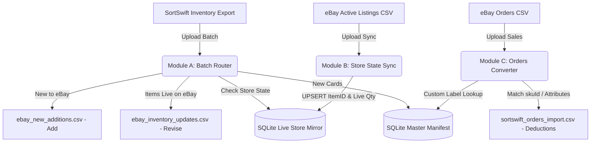

# TCG Card Inventory Middleware (SortSwift &harr; eBay Bridge)

A lightweight, containerized Python web application and standalone core library designed to run on a **Synology NAS** (via Docker / Container Manager) and developable directly on **Windows**.

This middleware connects **SortSwift** (TCGplayer Inventory Schema) and **eBay Seller Hub Reports**. It automates stock deductions, synchronizes single/variation listings, and bypasses eBay's 50-character SKU limit using an atomic SQLite database and compact sequential manifest IDs (`ID1001`, `ID1002`, ...).

---

## 📑 System Architecture & Workflow



---

### Module order

The dashboard presents the three modules in workflow order, and the letters
follow that order:

| Step | Module | What it does |
|---|---|---|
| 1 | **A** | Process a SortSwift batch into eBay Add / Revise files |
| 2 | **B** | Sync the resulting eBay listings back into the store mirror |
| 3 | **C** | Convert eBay orders into SortSwift stock deductions |

The order reflects the dependency chain: a batch has to be catalogued and listed
before eBay has anything to sync back, and the sync has to have linked the item
numbers before an order can be traced to a card.

---

## 🔐 Authentication: Google Sign-In Only

This application authenticates **exclusively through Google Sign-In**. There is no local username/password login and no development bypass, so there is exactly one way to become an authenticated user.

* **First User Auto-Admin**: The very first Google account to sign in is automatically granted the `admin` role and `active` status.
* **Admin Approval Required**: Every subsequent account lands in `pending` status and cannot process inventory until an admin approves it.
* **Admin Control Panel**: Sign in as the admin and click **"Users & Approvals"** in the top navigation bar to approve pending accounts, deactivate users, or promote users to admin.
* **Stable Identity**: Accounts are keyed on the Google `sub` claim, not the email address, so a user changing their Google email keeps the same local account and approval state.
* **`GOOGLE_CLIENT_ID` is required.** The app refuses to start without it rather than booting into a state where nobody can sign in.

### ⚠️ Google will not authorize a bare LAN address

Google requires OAuth JavaScript origins to use **HTTPS** and **rejects raw IP addresses**. The only exception is `localhost`. That means:

| Origin | Allowed? |
|---|---|
| `http://192.168.1.50:8080` | ❌ Never — raw IP and plain HTTP |
| `http://tcg.local:8080` | ❌ Plain HTTP, non-localhost |
| `http://localhost:8080` | ✅ The one plain-HTTP exception |
| `https://cards.yourname.synology.me` | ✅ Recommended for the NAS (see Step 2) |

So reaching the dashboard on your NAS requires an HTTPS hostname in front of the container. The setup is walked through below.

### Step 1 - Create the Google OAuth client

Google reorganized these screens into the **Google Auth Platform**; the old
"APIs & Services > OAuth consent screen" menu item no longer exists.

1. Go to <https://console.cloud.google.com> and create or select a project
   (the project name is internal and never shown to users).
2. In the left nav open **APIs & Services > OAuth consent screen**, which now
   lands on **Google Auth Platform**. If the project has never been configured,
   click **Get started**. Otherwise use the tabs described below. Direct link:
   <https://console.cloud.google.com/auth/overview>
3. **Branding** tab - set the **App name** (this is what users see on the
   consent screen, e.g. "TCG Inventory Middleware") and the **User support
   email**. Everything else on this tab is optional.
4. **Audience** tab - set the user type to **External**, and fill in the
   **Developer contact information** email if prompted.
   * While the app is in *Testing*, only accounts you list under **Test users**
     can sign in. Add your own Google account there.
   * Click **Publish app** to lift that restriction. With only the basic scopes
     below, publishing needs no Google review.
5. **Data Access** tab - click **Add or remove scopes** and select only
   `openid`, `.../auth/userinfo.email` and `.../auth/userinfo.profile`. These
   are non-sensitive, so Google does **not** require app verification.
6. **Clients** tab - click **Create client**. Direct link:
   <https://console.cloud.google.com/auth/clients>
   * **Application type**: `Web application`
   * **Name**: anything, e.g. "TCG Middleware Web"
7. Under **Authorized JavaScript origins**, click **Add URI** for each of:
   * `https://cards.yourname.synology.me` - production (scheme + host, no
     path, no trailing slash, no `:443`)
   * `http://localhost:8080` - Windows development
   * `http://localhost` - optional, harmless, avoids port surprises
8. Leave **Authorized redirect URIs empty.** The Google Identity Services
   button returns the credential to the page via `postMessage`, not an HTTP
   redirect. Adding one here is the single most common source of confusion.
9. Click **Create**. Copy the **Client ID** (it looks like
   `1234567890-abc123def456.apps.googleusercontent.com`) into your `.env`:
   ```bash
   GOOGLE_CLIENT_ID=1234567890-abc123def456.apps.googleusercontent.com
   ```
   There is **no client secret** in this flow. Google shows one, but this app
   does not use it. The Client ID alone is sufficient and is safe to expose in
   the browser.
10. Restart the app. Origin changes can take anywhere from 5 minutes to a few
    hours to propagate, so a fresh origin may be rejected briefly.

**Troubleshooting**

| Symptom | Cause |
|---|---|
| `Error 400: redirect_uri_mismatch` | You added a redirect URI. Remove it; this flow does not use one. |
| `The given origin is not allowed for the given client ID` | The browser's address bar does not exactly match an authorized origin (scheme, host and port must all match), or the change has not propagated yet. |
| Button does not render at all | `GOOGLE_CLIENT_ID` is unset or wrong, or the page cannot reach `accounts.google.com`. The dashboard shows an explanatory panel in this case. |
| `Access blocked: app has not completed verification` | The app is still in *Testing* and your account is not listed under **Audience > Test users**. |
| One Tap prompt never appears on `http://localhost` | Expected: One Tap requires HTTPS. The standard sign-in button still works. |

### Step 2 - Put HTTPS in front of the container (Synology)

Give the app **its own subdomain** rather than serving it on the bare DDNS
hostname. Synology resolves any subdomain of your DDNS name to the same NAS, so
`cards.yourname.synology.me` works with no extra DNS configuration.

This is not just cosmetic. All of this app's requests are rooted at `/`
(`/static/app.js`, `/api/...`), so a path-based proxy rule such as
`/cards/ -> localhost:8080` would break every asset and API call. Host-based
routing on a subdomain needs no rewriting. It also keeps the app on its own
browser origin, so its session cookie is not shared with DSM's own web UI or
any other reverse-proxied service on the NAS.

1. **Control Panel > External Access > DDNS** - add a Synology-provided
   hostname, e.g. `yourname.synology.me`. You register only this one name; the
   subdomain below needs no separate registration.
2. **Control Panel > Security > Certificate > Add > Add a new certificate >
   Get a certificate from Let's Encrypt**, then:
   * **Domain name**: `yourname.synology.me`
   * **Subject Alternative Name**: `*.yourname.synology.me`

   The wildcard SAN covers the bare hostname *and* every subdomain, so one
   certificate serves this app and anything else you host later, with a single
   renewal. Wildcard issuance is supported for Synology DDNS domains
   specifically; it is not available through the wizard for custom domains.
3. **Control Panel > Login Portal > Advanced > Reverse Proxy > Create**:
   * Source: `HTTPS` / `cards.yourname.synology.me` / port `443`
   * Destination: `HTTP` / `localhost` / port `8080`
   * On the **Custom Header** tab, use **Create > WebSocket** if you later add
     any streaming endpoints. Not required today.
4. Set the certificate for that subdomain under **Control Panel > Security >
   Certificate > Settings**, pointing `cards.yourname.synology.me` at the
   wildcard certificate.
5. Keep `COOKIE_SECURE=true` in the NAS `.env`. DSM terminates TLS; the
   container keeps serving plain HTTP internally on `8080`.
6. Register the subdomain as the authorized JavaScript origin in Google Cloud
   Console - **exactly** `https://cards.yourname.synology.me`, with no port and
   no trailing slash. Origins are matched exactly, so the bare
   `https://yourname.synology.me` is a *different* origin and would be
   rejected. Register both only if you intend to browse to both.

---

## 🐳 Synology NAS Deployment Guide

### 1. Requirements on Synology NAS
* Synology DSM 7.2+ with **Container Manager** (or Docker on DSM 7.0/7.1).
* SSH or File Station access.
* An HTTPS hostname reachable by your browser (see Step 2 above).

### 2. Deployment Steps via Docker Compose
1. Create a directory on your NAS for persistent data:
   ```bash
   mkdir -p /volume1/docker/tcg-middleware/data
   chmod -R 777 /volume1/docker/tcg-middleware/data
   ```
2. Make sure your work is on GitHub. Commits are pushed to
   [`mrhappyasthma/TCG-Inventory-Middleware`](https://github.com/mrhappyasthma/TCG-Inventory-Middleware)
   as they are made, so this is normally just a check:
   ```bash
   git status            # should be clean
   git log origin/main..HEAD   # should be empty
   ```
3. On your Synology NAS (via SSH or Container Manager Web UI):
   ```bash
   cd /volume1/docker/tcg-middleware
   git pull origin main
   docker-compose up -d --build
   ```
4. Access the dashboard at `https://cards.yourname.synology.me`.

`docker-compose` will refuse to start if `GOOGLE_CLIENT_ID` is not set in the environment or `.env`.

### 3. Avoiding Port Conflicts on Synology
If port `8080` is already used by another container on your NAS, set `HOST_PORT` in your `.env`:
```bash
HOST_PORT=8088
```
The container maps host port `8088` to container internal port `8080`. Point the reverse-proxy destination at whichever host port you chose.

### 4. Health Checks
The container exposes an unauthenticated probe at `/api/health`, which also verifies the SQLite volume is reachable and returns `503` if it is not. A Docker `HEALTHCHECK` is wired to it, so Container Manager shows the container as healthy or unhealthy rather than merely running.

---

## 💻 Windows Local Development & Testing Cycle

### 1. Setup Virtual Environment
```powershell
python -m venv .venv
.\.venv\Scripts\Activate.ps1
pip install -r requirements.txt
```

### 2. Configure `.env`
Copy `.env.example` to `.env`, then set your Client ID and relax the cookie flag for plain HTTP:
```bash
GOOGLE_CLIENT_ID=<your-id>.apps.googleusercontent.com
COOKIE_SECURE=false
```
Make sure `http://localhost:8080` is registered as an authorized JavaScript origin.

### 3. Run Locally on Windows
```powershell
python app/main.py
```
Open `http://localhost:8080`. Browsing via `http://127.0.0.1:8080` also works, but whichever form you use must match an authorized origin exactly.

### 4. Run Automated Tests
```powershell
# Run standalone engine unit tests
python -m unittest discover -s tcg_engine/tests

# Run web app & API integration tests
python -m unittest tests/test_web_app.py
```
The web tests stub Google token verification, so they need no network access and no real credentials.

---

## 📦 Standalone Core Package (`tcg-engine`) & CLI

The core business logic is packaged as an independent library in [`tcg_engine/`](./tcg_engine) with zero web dependencies.

### Running Standalone via CLI:
```powershell
# Initialize SQLite database
python -m tcg_engine.cli init-db --db data/inventory.db

# Module A: Route SortSwift Batch to eBay Add vs. Revise CSVs
python -m tcg_engine.cli batch sortswift_batch.csv --out-dir ./output --db data/inventory.db

# Module A: Re-apply a batch that has already been processed (adds quantities again)
python -m tcg_engine.cli batch sortswift_batch.csv --out-dir ./output --force --db data/inventory.db

# Module A: Rebuild the CSVs without touching inventory
python -m tcg_engine.cli batch sortswift_batch.csv --out-dir ./output --dry-run --db data/inventory.db

# Module B: Sync Active eBay Listings Report into Store State Mirror
python -m tcg_engine.cli sync active_listings.csv --db data/inventory.db

# Module C: Convert eBay Orders CSV to SortSwift Deduction CSV
python -m tcg_engine.cli orders sample_ebay_orders.csv -o sortswift_orders.csv --db data/inventory.db

# Export Master Catalog
python -m tcg_engine.cli export-manifest -o master_manifest.csv --db data/inventory.db

# Recover the catalog-to-eBay link after a rebuild (see below)
python -m tcg_engine.cli relink active_listings.csv --db data/inventory.db

# Purge the catalog for a clean test run (see below)
python -m tcg_engine.cli purge --db data/inventory.db
```

### Purging inventory while testing

```powershell
# Shows what would be deleted and exits without touching anything
python -m tcg_engine.cli purge --db data/inventory.db

# Actually delete
python -m tcg_engine.cli purge --yes --db data/inventory.db
```

This clears the **master catalog**, the **live store mirror** and the
**processed-batch fingerprints**, so manifest IDs restart at `ID1001` and a
previously uploaded batch can be processed again.

Your **pricing rules and listing settings survive** — postal code, business
policy names, `C:Game`, templates, the cover photo. That is the reason to prefer
this over deleting `data/inventory.db`, which would take your whole setup with
it. Use the file deletion only when you want to reset the configuration too.

Without `--yes` the command is a dry run: it prints the row counts it would
remove and exits.


---

## 💰 Configurable Tiered Pricing Rules

Pricing is driven entirely by the rules stored in the `pricing_rules` table, which you edit from the **Pricing Rules** screen on the dashboard. **The database is the source of truth** — the figures below are only the defaults the app ships with, and they stop being accurate the moment you edit a tier.

* **Rule Types Supported**:
  1. **Fixed Base Price ($)** (`fixed`) — the card is listed at a flat price, ignoring its market value.
  2. **Market Price + Diff ($)** (`markup_fixed`) — adds a fixed dollar amount to the base price.
  3. **Market Price + Markup (%)** (`markup_percent`) — adds a percentage markup to the base price.
* **Shipped Default Rules**:

  | Base price range | Rule | Result |
  |---|---|---|
  | `$0.00` – `$0.25` | `fixed` 1.99 | `$1.99` |
  | `$0.25` – `$0.50` | `fixed` 2.49 | `$2.49` |
  | `$0.50` – `$1.00` | `fixed` 2.99 | `$2.99` |
  | `$1.00` and above | `markup_fixed` 3.00 | base `+ $3.00` |

* **Range semantics**: a rule matches when `min_price <= base < max_price`. A rule with an empty `max_price` is open-ended and matches everything at or above its `min_price`.
* **Interactive Calculator**: The Pricing Rules page includes a live test calculator so you can enter any base price and see the computed eBay price immediately.
* **Reset Defaults**: restores exactly the four rules in the table above.

### How the base price is chosen

This is the precedence the engine actually applies, in order:

1. If the row has a non-zero **`eBay Price`** column (`Platform Price (Ebay)`, `eBay Price`, ...), that value is used **verbatim** and the pricing rules are skipped entirely. This lets you override pricing per card from SortSwift.
2. Otherwise the base price is the row's **`Market Price`** if it is greater than zero, else its **`Price`**.
3. That base is run through the pricing rules above.
4. If no rule matches and the base is greater than zero, the base is used unchanged.
5. If nothing at all resolves, the price falls back to **`$1.99`**.

---

## 🎴 Multi-Item Variation Grouping & Single Listings

Configure how the middleware splits and titles listings via the **"Listing Rules"** button on the dashboard:

* **Automated Set Grouping** (`group_by_set`, default on): cards sharing the same expansion set **and the same condition** are grouped into a single multi-variation drop-down listing. Condition is part of the grouping key because eBay applies one `ConditionID` to an entire listing, so a set holding both NM and LP cards correctly produces two listings rather than one mislabelled listing. Turn this **off** to list every card individually regardless of price.
* **Single Listing Value Threshold** (`single_threshold`, default `$5.00`): cards whose effective calculated price is **equal to or above** the threshold are split out as **standalone Single listings**. This only applies while set grouping is on.
* **Smart 80-Character Title Formatting**:
  * Default Title: `{set_name}: Pick Your Card - {condition} - Complete Your Set`
  * `{condition}` is substituted **verbatim** from your export, so the title always matches the cards it describes.
  * **Automatic Fallback**: if the title exceeds eBay's 80-character limit, the **set name** is trimmed. The condition is never abbreviated or altered, because the title makes a factual claim about the cards.
* **Dropdown option labels** (`variation_option_template`, default
  `{name} ({card_number})`): each card appears as e.g. `Crushing Gloves (133/198)`.
  The number keeps reprints distinguishable, and options are **always sorted by
  card number** so the dropdown reads in collector order rather than upload
  order. Sorting is numeric, not alphabetical — `4/198` comes before `16/198`
  before `133/198` — and handles prefixed numbering such as `TG12/TG30`. A card
  with no number falls back to just its name and sorts last.
* **One image per variation**: each child row's `PicURL` is written as
  `<option name>=<url>`, e.g.
  `Crushing Gloves (133/198)=https://cdn/gloves.jpg`. This prefix is required —
  eBay ignores a bare URL on a variation row, which is why only the listing's
  main photo used to appear. A card with no image gets an empty cell rather than
  a dangling separator. Note eBay permits per-variation photos on **one**
  variation attribute only; `Card` is our only one, so this is fine. Multiple
  images for a single variation would require eBay Picture Services, and eBay
  will not mix its own hosted images with self-hosted ones.
* **Cover photo** (`cover_image_url`, optional): sets the listing's main image.
  Leave it blank to use the first card in the set. Variations keep their own
  images either way.
* **Parent & Child Row Generation** in `ebay_new_additions.csv`:
  * **Parent Row**: `Relationship` is left **empty**, `RelationshipDetails = Card=Name1;Name2;...`, category `183454` (CCG Individual Cards), title, description and cover image.
  * **Child Rows**: `Relationship = Variation`, `RelationshipDetails = Card=Name1`, price, quantity, `ConditionID`, `CustomLabel` (`ID1001-Bin_A-12`) and image.
  * **Separators matter**: within one attribute eBay separates values with a semicolon; a pipe (`|`) begins a *different* attribute. A `;` or `|` appearing inside a card name is replaced with `/` so one card cannot be split into several bogus options.

---

## 🏷️ Physical Bin / Remark Location Encoding

When you export your SortSwift inventory, SortSwift includes your internal notes in the `Remarks` column (e.g. `Bin A-12`, `Box 4`, `TEF-01`):

* **Encoded into eBay Custom Label (SKU)**: when generating `ebay_new_additions.csv` and `ebay_inventory_updates.csv`, the engine formats the SKU as `ID1001-Bin_A-12` (non-alphanumeric characters become underscores, truncated to 20 characters).
* **Prints on the packing slip**: an incoming order shows `ID1001-Bin_A-12`, so you can pull the physical card from the exact bin without opening any other software.
* **Auto-Resolves in Deductions**: the orders parser extracts the base `ID1001` and retrieves the exact SortSwift `skuId` to deduct stock accurately.
* **Searchable in Dashboard**: search your catalog by bin location (e.g. `Bin A-12`) in the Live Inventory table, and sort by the Bin / Remark column. The table also shows a **Card #** column between Card Title and Expansion Set, sortable numerically (`4/198` before `133/198`, with prefixed numbering such as `TG12/TG30` after the plain numbers) and searchable.

---

## 🔁 Duplicate Batch Protection

Module A **adds** quantities to the live store mirror, because a SortSwift export represents newly scanned stock. Processing the same export twice would therefore double your eBay quantities.

To prevent that, every processed batch is fingerprinted (SHA-256 of the file
contents) in the `processed_batches` table. Re-uploading a file that has already
been applied is **refused before any database write happens** — the run returns
early, so a conflicting batch is a true no-op rather than a partial apply.

The dashboard then shows an inline warning naming when the file was last
processed, alongside two explicit choices. Nothing is auto-processed while a
conflict is outstanding.

| Button | Effect | CLI |
|---|---|---|
| **Download only — no inventory change** | Rebuilds both CSVs from your **current settings** and writes nothing at all: no catalogue entries, no quantity accumulation, no store-mirror update, no fingerprint. | `--dry-run` |
| **Force process (adds quantities)** | Applies the batch a second time. Quantities are added again. | `--force` |

"Download only" is the common case: you already processed the batch, then
changed a setting (a policy name, the postal code, the `C:Game` value) and need
the CSV rebuilt. It re-renders from scratch rather than replaying a stored file,
so the corrections are picked up.

Because it never writes, it cannot mint a manifest ID — a card not yet in the
catalogue is skipped with a warning rather than being catalogued silently. For
a card already live on eBay it reports the mirror's current quantity rather than
adding the batch quantity again, so the rebuilt file matches what was uploaded
the first time.

### Generated files are never auto-downloaded

Processing builds the output CSVs and holds them in the page, showing a *ready*
indicator with the row counts. Downloading is always an explicit click, so a run
you were only inspecting does not drop files into your Downloads folder. Use the
download buttons on each module card.

---

## 📊 CSV Schema Specifications

### 1. SortSwift Inventory Export Ingestion (Module A)
* **Input**: Fresh inventory CSV from SortSwift, or an eBay-style export with `*C:`-prefixed headers. Column matching is case-insensitive and accepts many aliases.
* **Fields Read**: `Name`, `Set`, `Condition` (NM, LP, MP, HP, DM), `Printing`, `Quantity`, `SKU Id`, `TCGplayer Id`, `Card Number`, `Set Code`, `Language`, `Remarks`, `Price`, `Market Price`, `eBay Price`, `CDN Image`, `Card Back CDN Image`, `Stock Image`, `ConditionID`.
* **Pricing**: see [How the base price is chosen](#how-the-base-price-is-chosen).
* **Condition**: both the `Condition` string and the numeric `ConditionID` are taken **verbatim from your export**. There is no translation table — the value originates in SortSwift and is destined for eBay or back into SortSwift, so interposing our own vocabulary would only create a third one that can disagree with both.
  * A row missing either value is **skipped with a warning** rather than having a condition guessed for it. If you see those warnings, re-export from SortSwift with the `ConditionID` column included.
  * One consequence: the Module C deduction CSV carries whatever string your export used (e.g. `NM`), not a normalised `Near Mint`. Matching on import is driven by `skuId` regardless.
* **A note on eBay's card ConditionIDs**: for the card categories (`183050`, `183454`, `261328`) eBay does *not* use its general used-goods scale. Ungraded cards use IDs extending **`4000`** and graded cards use IDs extending **`2750`**. So `4000` means "Ungraded", **not** "Lightly Played". The actual grade is expressed in a separate, required **Condition Descriptor** field limited to *Near Mint or Better*, *Excellent*, *Very Good* or *Poor* — which this generator does not yet emit. See the outstanding-work note below.

### 🃏 eBay Condition Descriptors (ungraded cards)

eBay has required a Condition Descriptor on trading-card listings since early
2024. For ungraded cards the descriptor is **Card Condition, ID 40001**, so the
generated file carries a **`CD:40001`** column.

eBay accepts exactly four ungraded grades, and SortSwift does not supply them,
so this is one place a translation is genuinely required. Your grade is mapped
as follows:

| SortSwift grade | eBay descriptor | Game/CCG value ID | Sports value ID |
|---|---|---|---|
| NM / Near Mint / Mint | Near mint or better | `400010` | `400010` |
| LP / Lightly Played | Excellent | `400015` | `400011` |
| MP / Moderately Played | Very good | `400016` | `400012` |
| HP / Heavily Played | Poor | `400017` | `400013` |
| DM / Damaged | Poor | `400017` | `400013` |

**The value IDs differ by card family.** Game/CCG categories (`183454`,
`183050`) and sports singles (`261328`) share only *Near mint or better*; the
correct table is selected automatically from your configured Category ID.
eBay has no bucket below *Poor*, so Heavily Played and Damaged both land there.

* **ConditionID stays `4000` for every ungraded card**, whatever its grade. The
  grade is expressed only by the descriptor. `4000` means "Ungraded" — it does
  **not** mean "Lightly Played".
* **Cell format** is configurable under Listing Rules, because reports differ on
  which form eBay accepts: `Excellent - (ID: 400015)` (default) or the bare
  `400015`. Switch it if an upload is rejected.
* **Explicit values win.** If your export already contains a `CD:40001` column,
  it is passed through verbatim and no mapping is applied.
* A condition that maps to none of the four grades is **skipped with a warning**
  rather than guessed at. Graded cards (ConditionID extending `2750`) need a
  different descriptor and are not supported yet; such rows are skipped.

### 📍 Seller requirements: postal code and business policies

eBay rejects an `Add` outright without an item location, returning:

```
10009  Error - No <Item.Location> exists or <Item.Location> is specified
       as an empty tag in the request. | Item.Location |
```

Configure these under **Listing Rules**:

| Setting | Column emitted | Shipped default |
|---|---|---|
| Seller Postal / ZIP Code | `PostalCode` | `94305` |
| Shipping policy name | `ShippingProfileName` | `Free Shipping Cards` |
| Return policy name | `ReturnProfileName` | `No Returns` |
| Payment policy name | `PaymentProfileName` | `Immediate Payment` |

These defaults are seeded on a fresh database and back-filled into an existing
one **only where the value is currently blank** — anything you have edited is
never overwritten. Change any of them under **Listing Rules** at any time; the
database is the source of truth.

* **`PostalCode` only, never `Location`.** The two are alternatives, and
  supplying both is a documented cause of the same 10009 error. eBay derives the
  displayed city/state from the zip.
* **Policy names must match exactly**, including case, as they appear under
  Seller Hub → Account → Business policies. They are passed through verbatim.
* **A policy left blank omits its column entirely** rather than sending an empty
  value, which eBay would reject.
* If the postal code is unset, the run logs an `ERROR` naming the eBay error code
  it will cause, so it is caught before the upload rather than after.

### 🏷️ eBay item specifics (`C:` columns)

eBay requires certain item specifics per category and rejects an `Add` without
them:

```
21919303  Error - The item specific Game is missing. Add Game to this
          listing, enter a valid value, and then try again. | Game |
```

Item specifics travel in columns prefixed `C:` (eBay's own templates mark the
required ones with a leading asterisk, e.g. `*C:Game` — the asterisk is an
annotation, not part of the field name).

**These are forwarded from your export, not reconstructed.** Any `C:`- or
`*C:`-prefixed column in the uploaded file is passed straight through to the
generated Add file, so whatever specifics SortSwift's eBay-flavoured export
provides — `Game`, `Set`, `Language`, `Card Name`, `Card Number`, `Finish` — are
carried over without needing a mapping. Adding a new specific to your export is
enough; no code change is required.

Two rules govern where they land:

* **Variation parent rows carry only the specifics every card in the group
  agrees on.** A listing has one set of listing-level specifics, so a field that
  differs between cards (`Card Name`, `Card Number`) cannot be stated there — the
  variation axis already expresses it. Uniform fields (`Game`, `Set`,
  `Language`) are included.
* **Single listings carry all of their own specifics**, since there is no group
  to reconcile.

**Specifics are also derived from plain columns.** If your export has no `C:`
columns at all, the following are built from the ordinary SortSwift columns
already parsed, so a plain export still produces a compliant listing:

| eBay specific | Read from |
|---|---|
| `C:Game` | `Game` |
| `C:Set` | `Set`, `Set Name`, `Expansion`, `Edition` |
| `C:Card Name` | `Name`, `Product Name`, `Card Name` |
| `C:Card Number` | `Card Number`, `Number` |
| `C:Language` | `Language` |
| `C:Rarity` | `Rarity` |
| `C:Finish` | `Printing`, `Finish`, `Variant`, `Foil` |

An explicit `C:`-prefixed column in the upload always wins over a derived one.
Each run logs exactly which specifics it included, so you can see what eBay will
receive:

```
[INFO] eBay item specifics included: C:Card Name, C:Card Number, C:Finish,
       C:Game, C:Language, C:Rarity, C:Set
```

#### `Game` is an override, not a fallback

`Game` is the one specific where the configured value **overrides** the export.
eBay only accepts values from its own list for the category — `Pokémon TCG`,
accent included — while SortSwift exports a looser label such as `Pokemon`,
which eBay rejects as invalid. So the **`C:Game` item specific** setting under
Listing Rules wins; clear it to fall back to the export's value.

Copy the value verbatim from one of your own existing listings. The safest way
to find any required specific and its exact spelling is to open a live listing
of the same kind and read them off it.

### ⚠️ Possibly still incomplete

Pending confirmation from a successful upload:

* The `Price` column is emitted alongside `StartPrice`; `Price` is probably not a
  valid File Exchange field for fixed-price listings and may be ignored.
* `PostalCode`, the Condition Descriptor and the policy columns are written to
  parent, child and single rows alike, mirroring how `ConditionID` is emitted. If
  eBay rejects any of them on child rows, restricting them to parents is a
  one-line change.

**Empirically confirmed by a real upload attempt:** the file parses, and eBay
validated as far as per-row field checks without complaining about the variation
syntax, the blank parent `Relationship`, the `CD:40001` column, the category or
the bare `Action` header. Those were the parts most at risk of being wrong.
* **Output 1 (`ebay_inventory_updates.csv`)** — Revise:
  ```
  Action,ItemID,CustomLabel,Quantity,Price
  ```
* **Output 2 (`ebay_new_additions.csv`)** — Add:
  ```
  Action,Category,Title,Relationship,RelationshipDetails,Description,ConditionID,StartPrice,Quantity,CustomLabel,PicURL,Format,Duration,Price,PostalCode,CD:40001,ShippingProfileName,ReturnProfileName,PaymentProfileName
  ```

### 2. eBay Active Listings Sync (Module B)
* **Input**: the official eBay **Active Listings** report. Get it from
  **Seller Hub → Reports → Download** (left menu) → *Download report* →
  source `Listings`, type `Active Listings`, format CSV. The report is queued and
  appears in the Downloads list once generated.
* **Fields Read**: `Item number`, `Custom label (SKU)`, `Available quantity`.
* **Behavior**: extracts the manifest ID from each variation's custom label and
  performs atomic UPSERTs into `ebay_variations`, linking every card to its live
  eBay item number and quantity.
* **The report contains your entire store**, not just listings this tool
  created, so most rows are expected to be skipped. Three distinct outcomes are
  reported separately, because conflating them made a healthy store look broken:

  | Outcome | Meaning |
  |---|---|
  | *variation parent row(s) ignored* | The container row of a multi-variation listing. Its children carry the labels. |
  | *listing(s) with no custom label ignored* | Ordinary listings not managed here. Entirely normal. |
  | *custom label(s) not found in the master catalog* | **Worth investigating** — a live listing references a manifest ID your catalog no longer has. |

* ⚠️ **Manifest IDs are the join key** between the catalog and your live
  listings. Running `purge` while a listing is live orphans it: every row comes
  back as "not found in the master catalog" and the sync reports 0 updated.

### 🔗 Recovering the link after a purge (`relink`)

If the catalog was rebuilt while listings were already live, the new manifest
IDs will not match the Custom Labels eBay holds. Rather than re-creating the
listings, realign the **catalog** to the labels already published — the listing
is the externally visible artefact, a manifest ID is an internal detail:

```powershell
python -m tcg_engine.cli relink active_listings.csv --db data/inventory.db
```

It matches each live variation to a catalog card using the listing's own
variation details (`Card=Ledyba (004/198)`), renames the card's manifest ID to
the one in the label, and then runs the Module B sync automatically. Pass
`--no-sync` to only realign.

It is deliberately conservative and will skip rather than guess:

* A card it cannot find in the catalog is reported, not invented.
* A name matching **several** catalog cards is left alone as ambiguous.
* If the target ID is already used by a different card, it refuses and says so.
* Running it twice is a no-op; the second run reports everything already correct.

Renaming carries any existing store-mirror row with it, so a card that was
already linked keeps its eBay item number and quantity.

---
### 3. eBay Orders to SortSwift Deduction Ingestion (Module C)
* **Input**: Raw eBay Orders report (`ebay_orders.csv`). Leading metadata lines are detected and skipped.
* **Fields Read**: `Custom Label` (contains `manifest_id`), `Quantity`, `Order Number`.
* **Output (`sortswift_orders_import.csv`)**:
  ```csv
  skuId,productId,Order Number,Product Name,Set Name,Condition,Printing,Quantity
  7805758,542678,ORD-501,Deerling - 016/162,SV05: Temporal Forces,NM,Normal,-1
  ```

* ⚠️ **Quantities are negative.** SortSwift's inventory import *adds* the
  quantity column to your existing stock, so a positive number increases
  inventory — the opposite of a deduction. Its documentation is explicit: *"if
  you place a negative number in the quantity field, it will remove that amount
  from your existing quantity."* Stock clamps at **0** rather than going
  negative, so over-deducting silently floors instead of erroring.
* **Matching is by `skuId`**, which uniquely identifies the card together with
  its condition, language and printing. `productId` is the fallback. The
  `Remark` column is not part of the match, and this file does not send one.


## 🗂️ Workspace tabs

The three working views share one tabbed area so the page stays a fixed height
rather than growing with your catalog:

| Tab | Shows |
|---|---|
| **Live Store Inventory** | The master catalog joined with live eBay links. Default view. |
| **eBay Listings** | Your live listings as eBay sees them, rolled up per item number. |
| **Terminal Console** | The operational log. |

Because the console can now be hidden, its tab carries an **unread counter** of
log lines that arrived while you were elsewhere, and the badge turns red if any
of them was an error — otherwise a failure could land on an invisible tab and go
unnoticed. Opening the tab clears it.

### eBay Listings

Derived from the store mirror rather than stored separately: the mirror is keyed
by card, so this groups by eBay item number to show the store the way eBay
presents it.

| Column | Meaning |
|---|---|
| **eBay Item #** | Links to the live listing. |
| **Expansion Set** / **Condition** | Taken from the cards on the listing. If a listing spans more than one, it says so in amber rather than showing only the first. |
| **Cards** | How many catalog cards are linked to this listing. |
| **Catalog Qty** | What your catalog holds across those cards. |
| **Live Qty** | What eBay last reported. Amber when it disagrees with Catalog Qty. |
| **Last Synced** | When Module B last touched this listing. |

The view is empty until a Module B sync has linked something, and refreshes
automatically after each sync. A listing spanning several sets or conditions is
usually a sign the grouping went wrong, which is why it is flagged rather than
hidden.

#### Changing a listing's cover photo

The **Cover Photo** column shows the recorded cover image per listing and opens
a dialog to change it. The URL is previewed in the browser first, which is a
cheap check: if it will not render there, eBay is unlikely to fetch it either.

Saving records the value **and downloads a Revise file**:

```csv
Action,ItemID,PicURL
Revise,227511361186,https://cdn.example.com/new-cover.jpg
```

Upload that to Seller Hub → Reports → Upload to apply it. Saving alone changes
nothing on eBay — the listing lives there, not here.

* ⚠️ **A revision replaces the listing's entire picture set.** eBay does not
  merge pictures; the uploaded set replaces what is present.
* eBay **ignores a URL identical to one already on the listing**, so re-sending
  the same address is a no-op. Use a different image.
* Do not mix eBay-hosted and self-hosted images on one listing; eBay rejects
  the combination.
* This is stored **per listing**, separately from the global **Cover photo URL**
  in Listing Rules — that one is the default applied to *new* listings Module A
  generates, whereas this overrides one specific live listing. A re-sync does not
  disturb it.

> **Note on the `ItemID` column**: a File Exchange *upload* identifies an
> existing listing with `ItemID`. `Item Number` is what the Active Listings
> *report* calls the same value, and is not a valid upload column — the batch
> Revise file previously used it, which would have left every row without an
> identifier.

---

## 🖥️ Live Store Inventory table

| Column | Behaviour |
|---|---|
| **Card Title** | Links to the card on TCGplayer, built from the `TCGplayer Id` in your export. Cards added manually have no ID, so they render as plain text. |
| **Card #** | Sorted numerically (`4/198` before `133/198`), prefixed numbering after the plain numbers. |
| **eBay Item #** | Links to the live listing. Only present once Module B has linked it. |
| **Quantity** | Click to adjust it (see below). |

An **expansion set filter** sits beside the search box, populated from the sets
actually present in the catalog — it can never offer a set with no cards behind
it. It **combines** with the search box rather than replacing it, so you can
narrow to one set and then search within it. If the selected set disappears
(after a purge, say) the filter falls back to showing everything rather than
silently filtering to nothing.

> **Note on the TCGplayer link**: it uses `https://www.tcgplayer.com/product/{id}`.
> Their site is a single-page app that returns HTTP 200 for any ID, so this form
> could not be verified automatically. If the links do not resolve, the pattern
> is a single constant (`TCGPLAYER_PRODUCT_URL`) at the top of
> `app/static/app.js`.

### Adjusting a quantity by hand

Clicking a **Quantity** value opens a dialog for quick corrections — a
miscount, a card pulled for a trade, damage found after scanning.

* The figure you enter is **absolute**. Unlike batch intake, which accumulates,
  this replaces the stored value.
* Optionally tick **Generate SortSwift deduction CSV** to get a deduction file
  for the difference, in exactly the format a real order produces, so the same
  correction can be applied in SortSwift. The quantity in that file is
  **negative**, because SortSwift's import adds the column to existing stock.
* A deduction is only produced when the quantity **decreases**; raising it has
  nothing to deduct, and the dialog says so before you save.
* The order number defaults to `MANUAL-<manifest id>` so hand corrections are
  distinguishable from real orders in SortSwift.

This adjusts the **catalog** quantity only. It does not revise the eBay
listing — run Module A for that.

---

## 📦 Quantity vs Live Stock

The Live Store Inventory table shows two counts side by side so drift is
visible at a glance:

| Column | Meaning | Written by |
|---|---|---|
| **Quantity** | Total stock **you** have catalogued for that card, read from the `Quantity` column of your SortSwift export and accumulated across every batch you have processed. | Module A |
| **Live Stock** | The quantity **eBay** last reported for it. | Module B (Active Listings sync) |

When the two disagree the pair is highlighted amber, with a tooltip naming both
figures. A mismatch usually means one of:

* You have processed a batch but not yet uploaded the resulting
  `ebay_inventory_updates.csv` to eBay, so eBay is behind.
* Cards have sold since your last Active Listings sync, so **eBay** is ahead
  (lower) and your catalogue is stale until you run Module B again.
* A listing was edited directly on eBay.

Both figures are included in the Master Catalog CSV export, and both columns
are sortable, so you can bring the largest discrepancies to the top.

Note that the two counts are *expected* to differ right after a batch and to
converge after an Active Listings sync. The column is a reconciliation aid, not
an error indicator.

---

## 💾 Backup and restore

The inventory database holds more than the CSV export can carry: the catalog,
eBay links, catalogued quantities, pricing rules, listing settings and cover
photo overrides.

Both live behind the **Database** button in the top navigation, which appears
for administrators only and carries an `ADMIN` badge. The endpoints enforce that
too — hiding the button is not the control, and a non-admin request returns
`403` whether or not the button was ever on screen.

### Backup

**Download backup** produces `tcg-inventory-<timestamp>.db`.

Taken server-side with `VACUUM INTO`, which checkpoints the write-ahead log into
the file. This matters: both databases run in **WAL mode**, so copying a `.db`
by hand can capture a database whose most recent commits are still sitting in a
`-wal` sidecar. The download can never be stale that way, and needs no sidecar
files alongside it.

User accounts are **not** included — they live in a separate `users.db`, and the
session secret is a separate file again.

### Restore

**Restore** replaces the inventory database from a backup file. It replaces the
data **every** user sees, so it is not a personal action.

The flow is deliberately two-step:

1. **Check file** validates and summarises it — *"Catalog cards 0 → 35"* — and
   applies nothing.
2. **Replace database** is only enabled once a file has passed that check, and
   asks for confirmation.

Safety behaviour:

* A file that is not SQLite, fails `PRAGMA integrity_check`, or lacks the
  expected tables is **rejected outright**, leaving the current data untouched.
* Your current database is copied aside as
  `data/inventory-backup-<timestamp>.db` before anything is overwritten, so a
  restore is reversible.
* Stale `-wal`/`-shm` sidecars from the old database are removed first —
  applied to a different file they would corrupt it.
* The replacement is an atomic `os.replace` within the same directory, so the
  database is never left half-written.
* Migrations run against the restored file, so a backup from an older build
  still opens.

**User accounts are never touched.** `users.db` is deliberately out of scope:
importing one whose Google `sub` did not match your account would remove your
own admin access with no way back through the UI. It is also self-healing —
delete it and the next Google sign-in becomes admin.

---

## 🛡️ Persistent Storage on NAS

All master catalog cards, live eBay item links, and user accounts are saved under the mounted data volume:

* `/data/inventory.db` &rarr; Catalog, live store mirror, pricing rules, listing settings, batch fingerprints
* `/data/users.db` &rarr; User accounts & admin privileges
* `/data/.session_secret` &rarr; Auto-generated session-signing secret (only if `JWT_SECRET` is not set)

Because `/data` is mounted to `/volume1/docker/tcg-middleware`, your inventory and accounts remain intact across container updates and restarts.

The master catalog additionally enforces a unique index on the card natural key (name + set + condition + printing), and manifest IDs are allocated inside a single write transaction, so two concurrent batch uploads cannot produce duplicate or colliding catalog entries.

---

## 🎨 Offline-Friendly Front End

Tailwind CSS and the web fonts are **vendored** into `app/static/vendor/` rather than loaded from a CDN, so the dashboard renders correctly on a NAS with no outbound internet access. The only external script is Google's Identity Services client, which is required for sign-in.
