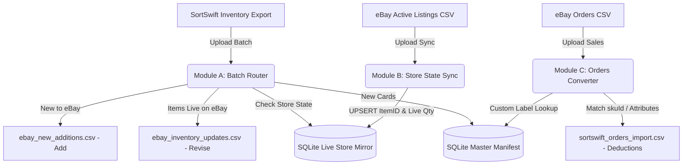

# TCG Card Inventory Middleware (SortSwift &harr; eBay Bridge)

A lightweight, containerized Python web application and standalone core library designed to run on a **Synology NAS** (via Docker / Container Manager) and developable directly on **Windows**.

This middleware connects **SortSwift** (TCGplayer Inventory Schema) and **eBay Seller Hub Reports**. It automates stock deductions, synchronizes single/variation listings, and bypasses eBay's 50-character SKU limit using an atomic SQLite database and compact sequential manifest IDs (`ID1001`, `ID1002`, ...).

---

## 📑 System Architecture & Workflow



---

### Module order

The dashboard presents the three modules in workflow order, and the letters
follow that order:

| Step | Module | What it does |
|---|---|---|
| 1 | **A** | Process a SortSwift batch into eBay Add / Revise files |
| 2 | **B** | Sync the resulting eBay listings back into the store mirror |
| 3 | **C** | Convert eBay orders into SortSwift stock deductions |

The order reflects the dependency chain: a batch has to be catalogued and listed
before eBay has anything to sync back, and the sync has to have linked the item
numbers before an order can be traced to a card.

---

## 🔐 Authentication: Google Sign-In Only

This application authenticates **exclusively through Google Sign-In**. There is no local username/password login and no development bypass, so there is exactly one way to become an authenticated user.

* **First User Auto-Admin**: The very first Google account to sign in is automatically granted the `admin` role and `active` status.
* **Admin Approval Required**: Every subsequent account lands in `pending` status and cannot process inventory until an admin approves it.
* **Admin Control Panel**: Sign in as the admin, click your name in the top-right, and choose **"Users & Approvals"** to approve pending accounts, deactivate users, or promote users to admin. The account menu also holds **Database** for admins, and **Sign out** for everyone.
* **Stable Identity**: Accounts are keyed on the Google `sub` claim, not the email address, so a user changing their Google email keeps the same local account and approval state.
* **`GOOGLE_CLIENT_ID` is required.** The app refuses to start without it rather than booting into a state where nobody can sign in.

### ⚠️ Google will not authorize a bare LAN address

Google requires OAuth JavaScript origins to use **HTTPS** and **rejects raw IP addresses**. The only exception is `localhost`. That means:

| Origin | Allowed? |
|---|---|
| `http://192.168.1.50:8080` | ❌ Never — raw IP and plain HTTP |
| `http://tcg.local:8080` | ❌ Plain HTTP, non-localhost |
| `http://localhost:8080` | ✅ The one plain-HTTP exception |
| `https://cards.yourname.synology.me` | ✅ Recommended for the NAS (see Step 2) |

So reaching the dashboard on your NAS requires an HTTPS hostname in front of the container. The setup is walked through below.

### Step 1 - Create the Google OAuth client

Google reorganized these screens into the **Google Auth Platform**; the old
"APIs & Services > OAuth consent screen" menu item no longer exists.

1. Go to <https://console.cloud.google.com> and create or select a project
   (the project name is internal and never shown to users).
2. In the left nav open **APIs & Services > OAuth consent screen**, which now
   lands on **Google Auth Platform**. If the project has never been configured,
   click **Get started**. Otherwise use the tabs described below. Direct link:
   <https://console.cloud.google.com/auth/overview>
3. **Branding** tab - set the **App name** (this is what users see on the
   consent screen, e.g. "TCG Inventory Middleware") and the **User support
   email**. Everything else on this tab is optional.
4. **Audience** tab - set the user type to **External**, and fill in the
   **Developer contact information** email if prompted.
   * While the app is in *Testing*, only accounts you list under **Test users**
     can sign in. Add your own Google account there.
   * Click **Publish app** to lift that restriction. With only the basic scopes
     below, publishing needs no Google review.
5. **Data Access** tab - click **Add or remove scopes** and select only
   `openid`, `.../auth/userinfo.email` and `.../auth/userinfo.profile`. These
   are non-sensitive, so Google does **not** require app verification.
6. **Clients** tab - click **Create client**. Direct link:
   <https://console.cloud.google.com/auth/clients>
   * **Application type**: `Web application`
   * **Name**: anything, e.g. "TCG Middleware Web"
7. Under **Authorized JavaScript origins**, click **Add URI** for each of:
   * `https://cards.yourname.synology.me` - production (scheme + host, no
     path, no trailing slash, no `:443`)
   * `http://localhost:8080` - Windows development
   * `http://localhost` - optional, harmless, avoids port surprises
8. Leave **Authorized redirect URIs empty.** The Google Identity Services
   button returns the credential to the page via `postMessage`, not an HTTP
   redirect. Adding one here is the single most common source of confusion.
9. Click **Create**. Copy the **Client ID** (it looks like
   `1234567890-abc123def456.apps.googleusercontent.com`) into your `.env`:
   ```bash
   GOOGLE_CLIENT_ID=1234567890-abc123def456.apps.googleusercontent.com
   ```
   There is **no client secret** in this flow. Google shows one, but this app
   does not use it. The Client ID alone is sufficient and is safe to expose in
   the browser.
10. Restart the app. Origin changes can take anywhere from 5 minutes to a few
    hours to propagate, so a fresh origin may be rejected briefly.

**Troubleshooting**

| Symptom | Cause |
|---|---|
| `Error 400: redirect_uri_mismatch` | You added a redirect URI. Remove it; this flow does not use one. |
| `The given origin is not allowed for the given client ID` | The browser's address bar does not exactly match an authorized origin (scheme, host and port must all match), or the change has not propagated yet. |
| Button does not render at all | `GOOGLE_CLIENT_ID` is unset or wrong, or the page cannot reach `accounts.google.com`. The dashboard shows an explanatory panel in this case. |
| `Access blocked: app has not completed verification` | The app is still in *Testing* and your account is not listed under **Audience > Test users**. |
| One Tap prompt never appears on `http://localhost` | Expected: One Tap requires HTTPS. The standard sign-in button still works. |

### Step 2 - Put HTTPS in front of the container (Synology)

Give the app **its own subdomain** rather than serving it on the bare DDNS
hostname. Synology resolves any subdomain of your DDNS name to the same NAS, so
`cards.yourname.synology.me` works with no extra DNS configuration.

This is not just cosmetic. All of this app's requests are rooted at `/`
(`/static/app.js`, `/api/...`), so a path-based proxy rule such as
`/cards/ -> localhost:8080` would break every asset and API call. Host-based
routing on a subdomain needs no rewriting. It also keeps the app on its own
browser origin, so its session cookie is not shared with DSM's own web UI or
any other reverse-proxied service on the NAS.

1. **Control Panel > External Access > DDNS** - add a Synology-provided
   hostname, e.g. `yourname.synology.me`. You register only this one name; the
   subdomain below needs no separate registration.
2. **Control Panel > Security > Certificate > Add > Add a new certificate >
   Get a certificate from Let's Encrypt**, then:
   * **Domain name**: `yourname.synology.me`
   * **Subject Alternative Name**: `*.yourname.synology.me`

   The wildcard SAN covers the bare hostname *and* every subdomain, so one
   certificate serves this app and anything else you host later, with a single
   renewal. Wildcard issuance is supported for Synology DDNS domains
   specifically; it is not available through the wizard for custom domains.
3. **Control Panel > Login Portal > Advanced > Reverse Proxy > Create**:
   * Source: `HTTPS` / `cards.yourname.synology.me` / port `443`
   * Destination: `HTTP` / `localhost` / port `8080`
   * On the **Custom Header** tab, use **Create > WebSocket** if you later add
     any streaming endpoints. Not required today.
4. Set the certificate for that subdomain under **Control Panel > Security >
   Certificate > Settings**, pointing `cards.yourname.synology.me` at the
   wildcard certificate.
5. Keep `COOKIE_SECURE=true` in the NAS `.env`. DSM terminates TLS; the
   container keeps serving plain HTTP internally on `8080`.
6. Register the subdomain as the authorized JavaScript origin in Google Cloud
   Console - **exactly** `https://cards.yourname.synology.me`, with no port and
   no trailing slash. Origins are matched exactly, so the bare
   `https://yourname.synology.me` is a *different* origin and would be
   rejected. Register both only if you intend to browse to both.

---

## 🔔 eBay keyset and the account deletion endpoint

The eBay integration is optional. With `EBAY_CLIENT_ID`, `EBAY_CLIENT_SECRET`
and `EBAY_REDIRECT_URI` unset, this is exactly the CSV tool it has always been.

### eBay disables a keyset until you comply

Before a keyset works — you will see *"Your keyset is currently disabled"* —
eBay requires every developer to either **receive marketplace account
deletion/closure notifications** or **hold an exemption**. The exemption is
only for applications that do not persist eBay data.

This application qualifies for the exemption: it stores no eBay user personal
data (see [the compliance
invariant](docs/ebay-api-design.md#7a-compliance-no-ebay-user-personal-data-ever)).
The endpoint is implemented anyway, because receiving the notification is a
fact while an exemption is an attestation somebody has to keep true.

### What to enter in eBay's console

On **Alerts & Notifications → Marketplace account deletion**:

| Field | Value |
|---|---|
| Notification endpoint | `https://<your-host>/api/ebay/notifications` |
| Verification token | the value of `EBAY_VERIFICATION_TOKEN`, byte for byte |

Then press eBay's **Send Test Notification** / save. eBay issues a one-time
`GET` with a `challenge_code`, and the endpoint answers with the SHA-256 of
the challenge code, the verification token and the endpoint URL, in that
order.

> ⚠️ **`EBAY_NOTIFICATION_ENDPOINT` must be the public URL exactly as typed
> into eBay's console.** The challenge response hashes that string, and behind
> the DSM reverse proxy the URL the container sees is not the URL eBay called.
> A mismatch — even a trailing slash — fails validation with an error that
> never explains itself. This is the single commonest cause of that failure,
> which is why the URL is configuration rather than being read off the request.

The endpoint must be deployed and publicly reachable over HTTPS *before* you
save it, or validation fails and there is nothing to retry against.

### Two mechanisms, one URL

| Method | Purpose | Failure |
|---|---|---|
| `GET` | eBay's one-time endpoint validation challenge | `400` without a code, `503` if unconfigured |
| `POST` | a real, signed notification | `412` if the signature does not verify |

The `POST` verifies the **raw request bytes** against eBay's ECDSA signature,
fetching the verification key by the key id in the `X-EBAY-SIGNATURE` header
and caching it for an hour as eBay's documentation asks. A payload that does
not verify is never acted upon: anyone who learns this URL can post to it, so
an unverified notification is an anonymous request that merely resembles eBay.

### Other constraints worth knowing before you start

* **eBay rejects `localhost` and plain HTTP for the OAuth redirect**, with no
  development carve-out — unlike Google, which exempts `localhost`. The
  callback has to be your public HTTPS hostname even while testing.
* **`EBAY_REDIRECT_URI` is a RuName, not a URL.** eBay generates it after you
  register the redirect under *User Tokens → Get a Token from eBay via Your
  Application*. It looks like `Mark_Klara-MarkKlar-abc12-xyzabcd`.
* **Do not configure Platform Notifications until a receiver exists.** After
  enough consecutive delivery failures eBay stops sending notifications for
  your AppID and reinstating delivery requires contacting Developer Technical
  Support. Order notifications are only a latency optimisation here anyway —
  polling is the correctness mechanism.

---

## 🐳 Synology NAS Deployment Guide

### 1. Requirements on Synology NAS
* Synology DSM 7.2+ with **Container Manager** (or Docker on DSM 7.0/7.1).
* SSH or File Station access.
* An HTTPS hostname reachable by your browser (see Step 2 above).

### 2. Deployment Steps via Docker Compose
1. Create a directory on your NAS for persistent data:
   ```bash
   mkdir -p /volume1/docker/tcg-middleware/data
   chmod -R 777 /volume1/docker/tcg-middleware/data
   ```
2. Make sure your work is on GitHub. Commits are pushed to
   [`mrhappyasthma/TCG-Inventory-Middleware`](https://github.com/mrhappyasthma/TCG-Inventory-Middleware)
   as they are made, so this is normally just a check:
   ```bash
   git status            # should be clean
   git log origin/main..HEAD   # should be empty
   ```
3. On your Synology NAS (via SSH or Container Manager Web UI):
   ```bash
   cd /volume1/docker/tcg-middleware
   ./deploy.sh
   ```
4. Access the dashboard at `https://cards.yourname.synology.me`.

`docker-compose` will refuse to start if `GOOGLE_CLIENT_ID` is not set in the environment or `.env`.

### `deploy.sh`

Pulls, and rebuilds only when something that reaches the image changed. The
equivalent by hand is `git pull origin main && docker compose up -d --build`,
which rebuilds every time — including for a commit that only touched the
README.

What it does, and why each part is the way it is:

* **Compares `HEAD` before and after the pull** rather than grepping for
  "Already up to date." That string is human-facing text which varies by git
  version and locale; a revision either changed or it did not.
* **Pulls `--ff-only`.** This checkout is a consumer of `origin/main` and
  nothing else. Without it, one stray local commit turns a deploy into a merge.
* **Rebuilds only for paths that reach the image**: `app/`, `tcg_engine/`,
  `ebay_client/`, `requirements.txt`, `Dockerfile`, `docker-compose.yml`. A
  docs-only or tests-only commit needs no rebuild. Note that `app/static`
  *does* count — the dashboard's HTML, JS and CSS are `COPY`ed into the image,
  so a UI change needs a rebuild even though it feels like a static asset.
* **Starts the stack if nothing is running**, even when nothing was pulled. A
  previous run could have pulled successfully and then failed to build, and
  without this every later deploy would decline to fix a site that is down.
* **Prints `ps` afterwards.** A build can succeed and the container still exit
  on startup — a missing dependency did exactly that once, and the symptom was
  a 502 from the reverse proxy rather than anything Docker complained about.

Two things it deliberately cannot detect:

* **`.env` changes.** `.env` is gitignored, so a pull never sees it. After
  editing it, run `docker compose up -d` yourself to recreate the container
  with the new environment — no rebuild is needed, since environment variables
  are not baked into the image.
* **A change made directly on the NAS.** `--ff-only` will refuse to pull over
  local edits rather than silently discarding them, which is the intended
  behaviour; resolve it by hand.

### 3. Avoiding Port Conflicts on Synology
If port `8080` is already used by another container on your NAS, set `HOST_PORT` in your `.env`:
```bash
HOST_PORT=8088
```
The container maps host port `8088` to container internal port `8080`. Point the reverse-proxy destination at whichever host port you chose.

### 4. Health Checks
The container exposes an unauthenticated probe at `/api/health`, which also verifies the SQLite volume is reachable and returns `503` if it is not. A Docker `HEALTHCHECK` is wired to it, so Container Manager shows the container as healthy or unhealthy rather than merely running.

---

## 💻 Windows Local Development & Testing Cycle

### 1. Setup Virtual Environment
```powershell
python -m venv .venv
.\.venv\Scripts\Activate.ps1
pip install -r requirements.txt
```

### 2. Configure `.env`
Copy `.env.example` to `.env`, then set your Client ID and relax the cookie flag for plain HTTP:
```bash
GOOGLE_CLIENT_ID=<your-id>.apps.googleusercontent.com
COOKIE_SECURE=false
```
Make sure `http://localhost:8080` is registered as an authorized JavaScript origin.

### 3. Run Locally on Windows
```powershell
python app/main.py
```
Open `http://localhost:8080`. Browsing via `http://127.0.0.1:8080` also works, but whichever form you use must match an authorized origin exactly.

### 4. Run Automated Tests
```powershell
# Run standalone engine unit tests
python -m unittest discover -s tcg_engine/tests

# Run the eBay client library's tests. The -t is required, not cosmetic:
# without it the outer ebay_client/ directory shadows the installed package.
python -m unittest discover -s ebay_client/tests -t ebay_client

# Run web app, API integration and deployment tests
python -m unittest discover -s tests
```
The web tests stub Google token verification and the eBay client's tests inject
an HTTP opener, so nothing needs network access or real credentials.

`tests/test_deployment.py` guards the *packaging* rather than the code. It
asserts that every editable install in `requirements.txt` is also copied and
pip-installed by the `Dockerfile`, and it boots the app in a subprocess — once
normally, and once with `ebay_client` deliberately unimportable — to confirm
the dashboard survives a missing optional dependency. Both checks exist because
a local package listed only as `-e ./ebay_client` was silently absent from the
image, and the resulting `ImportError` took the whole site down with a 502.

---

## 📦 Standalone Core Package (`tcg-engine`) & CLI

The core business logic is packaged as an independent library in [`tcg_engine/`](./tcg_engine) with zero web dependencies.

### Running Standalone via CLI:
```powershell
# Initialize SQLite database
python -m tcg_engine.cli init-db --db data/inventory.db

# Module A: Route SortSwift Batch to eBay Add vs. Revise CSVs
python -m tcg_engine.cli batch sortswift_batch.csv --out-dir ./output --db data/inventory.db

# Module A: Re-apply a batch that has already been processed (adds quantities again)
python -m tcg_engine.cli batch sortswift_batch.csv --out-dir ./output --force --db data/inventory.db

# Module A: Rebuild the CSVs without touching inventory
python -m tcg_engine.cli batch sortswift_batch.csv --out-dir ./output --dry-run --db data/inventory.db

# Module B: Sync Active eBay Listings Report into Store State Mirror
python -m tcg_engine.cli sync active_listings.csv --db data/inventory.db

# Module C: Convert eBay Orders CSV to SortSwift Deduction CSV
python -m tcg_engine.cli orders sample_ebay_orders.csv -o sortswift_orders.csv --db data/inventory.db

# Export Master Catalog
python -m tcg_engine.cli export-manifest -o master_manifest.csv --db data/inventory.db

# Recover the catalog-to-eBay link after a rebuild (see below)
python -m tcg_engine.cli relink active_listings.csv --db data/inventory.db

# Purge the catalog for a clean test run (see below)
python -m tcg_engine.cli purge --db data/inventory.db
```

### Purging inventory while testing

```powershell
# Shows what would be deleted and exits without touching anything
python -m tcg_engine.cli purge --db data/inventory.db

# Actually delete
python -m tcg_engine.cli purge --yes --db data/inventory.db
```

This clears the **master catalog**, the **live store mirror** and the
**processed-batch fingerprints**, so manifest IDs restart at `ID1001` and a
previously uploaded batch can be processed again.

Your **pricing rules and listing settings survive** — postal code, business
policy names, `C:Game`, templates, the cover photo. That is the reason to prefer
this over deleting `data/inventory.db`, which would take your whole setup with
it. Use the file deletion only when you want to reset the configuration too.

Without `--yes` the command is a dry run: it prints the row counts it would
remove and exits.


---

## 💰 Configurable Tiered Pricing Rules

Pricing is driven entirely by the rules stored in the `pricing_rules` table, which you edit from the **Pricing Rules** screen on the dashboard. **The database is the source of truth** — the figures below are only the defaults the app ships with, and they stop being accurate the moment you edit a tier.

**Pricing rules and listing settings are per-user.** Each signed-in account has
its own set, so two people sharing an instance can list the same catalog at
different prices, under different titles, against different eBay business
policies. See [Per-user rules](#-per-user-rules) for how inheritance and reset
work.

* **Rule Types Supported**:
  1. **Fixed Base Price ($)** (`fixed`) — the card is listed at a flat price, ignoring its market value.
  2. **Market Price + Diff ($)** (`markup_fixed`) — adds a fixed dollar amount to the base price.
  3. **Market Price + Markup (%)** (`markup_percent`) — adds a percentage markup to the base price.
* **Shipped Default Rules**:

  | Base price range | Rule | Result |
  |---|---|---|
  | `$0.00` – `$0.25` | `fixed` 1.99 | `$1.99` |
  | `$0.25` – `$0.50` | `fixed` 2.49 | `$2.49` |
  | `$0.50` – `$1.00` | `fixed` 2.99 | `$2.99` |
  | `$1.00` and above | `markup_fixed` 3.00 | base `+ $3.00` |

* **Range semantics**: a rule matches when `min_price <= base < max_price`. A rule with an empty `max_price` is open-ended and matches everything at or above its `min_price`.
* **Interactive Calculator**: The Pricing Rules page includes a live test calculator so you can enter any base price and see the computed eBay price immediately.
* **Reset Defaults**: restores exactly the four rules in the table above.

### Market price refresh

Prices come from [TCGCSV](https://tcgcsv.com/), a free daily mirror of
TCGplayer's own catalogue and price data. TCGplayer's official API has been
closed to new applicants for years, and the mirror carries the same numbers:
the Market/Low/Mid/High columns in a SortSwift export were verified field for
field against TCGCSV's product prices for the same cards.

The join is **`(tcgplayer_id, printing)`**. It has to include the printing:
TCGCSV returns a row per printing, and on real cards Normal and Reverse
Holofoil differ by 2-6x, so joining on the product alone would price every
reverse holo as a normal - a silent underprice that looks entirely plausible.
Their set `abbreviation` is your `set_code` (`SWSH06` on both sides), which is
what removes the need for a hand-maintained set map.

Their documented limits are treated as hard constraints:

| | |
|---|---|
| Updates | Once per day |
| Politeness | `last-updated.txt` is checked first; an already-current day costs **one** request, not one per set |
| Hard cap | Ban above 10,000 requests/24h - a refresh here is one request per set held |
| Spacing | 100 ms between requests |
| User-Agent | A custom one is sent; generic headers may be blocked |
| CORS | Restrictive, so this runs server-side only |

A refresh runs automatically once a day (`PRICE_REFRESH_ENABLED`,
`PRICE_REFRESH_INTERVAL_HOURS`) and on demand from **Refresh now** in the
Pricing Rules dialog. Two safety properties matter more than the schedule:

* **A missing or failed price never becomes `0`.** The rules multiply against
  this number, so a silent zero would reprice the whole catalogue to the
  floor. An unreachable feed leaves every stored price exactly as it was, and
  a card TCGCSV has no price for keeps whatever it already had.
* **Every value is kept in `price_history`.** A reprice that surprises you is
  only diagnosable if the number it came from still exists.

### The reprice file

Module A prices from the columns of the export it is handed, so without this
there is no way to push a new price without re-uploading a dump. **Download
`ebay_reprice_updates.csv`** builds an eBay Revise file from the stored prices
and your own rules:

```
Action,ItemID,CustomLabel,Price
Revise,227511361186,ID1050-C-1,7.00
```

* **No `Quantity` column.** A reprice must not touch stock, and an absent
  column is how File Exchange is told to leave a field alone.
* **Only listings whose price actually changed**, on the same principle as
  Module A - a file of unchanged rows tells you nothing and asks eBay to
  rewrite every listing for no reason.
* The `CustomLabel` is the one **eBay** reported, never one rebuilt from a
  card's identity.
* **Listings the Inventory API manages are excluded.** Automatic repricing
  owns those, and File Exchange cannot revise them anyway - the upload would
  succeed and change nothing.

When a reprice is pending, an amber **Reprice N** pill appears in the header.
It is deliberately persistent rather than a toast: the nightly refresh
finishes with nobody watching, so the signal has to survive until it is acted
on.

### Automatic repricing

For the listings this application created through the eBay **Inventory API**
there is no file to download and nobody to upload it: a price can be changed
directly. That runs once a day, in the same loop iteration as the market price
refresh, and applies price changes by itself.

It is asymmetric on purpose, because the two directions are not equally safe:

* **A rise applies the same day.** If the market recovers afterwards the card
  was underpriced anyway, so waiting costs more than acting.
* **A fall is held.** The current price stays up until the lower computed price
  has kept being true for the whole **hold window** (14 days by default).
  Lowering a price gives away margin that only a sale at the higher price
  could have earned. If the market recovers at any point inside the window the
  clock resets - the window measures an unbroken run, not a total.

Two thresholds stop it thrashing, and they are the reason it is safe to leave
unattended:

* **Boundary margin** (10% by default). The pricing tiers are cliffs. On the
  shipped rules a card at a market price of `$0.249` lists at `$1.99` and one
  at `$0.251` lists at `$2.49` - a one-cent move producing a **25% price
  change**, every single day, for any card sitting near an edge. The market
  therefore has to move 10% *past* a boundary before the card changes tier.
  This matters more than the hold window does, because it prevents the churn
  rather than merely delaying it.
* **Refuse run over** (25% by default). If more than a quarter of eligible
  cards would change in one run, the whole run is abandoned having written
  nothing - that pattern is what bad price-feed data looks like, not what a
  real market does. It is not applied below 20 eligible cards, where the ratio
  carries no information.

What it will not do, by construction:

* **It sends price and nothing else.** `shipToLocationAvailability` is omitted
  from the request rather than repeated, so quantity cannot move. Nothing is
  created, published, revised or ended.
* **It cannot touch a File Exchange listing.** Eligibility comes from a join
  against `ebay_managed_listing` plus a stored offer id, so the four legacy
  listings are not merely skipped - they are unreachable from this path.
* **It never prices from nothing.** A card with no stored market price, no
  known eBay price, or a market price no rule covers is left alone and
  reported, never priced at the floor.

Every verdict - including the holds and the skips - is logged to the terminal
with a `[reprice]` prefix and written to `reprice_history`, readable at
`GET /api/pricing/reprice-log`. Holds are logged at `WARN` and shown with an
amber flag in **Pricing Rules -> Automatic Repricing**: a card priced above
what the market now supports is the one thing here worth a human glance.
**Run now** applies a round immediately, after showing what it will change.

All four settings live under **Pricing Rules -> Automatic Repricing**:
`auto_reprice_enabled`, `price_hold_days`, `price_boundary_margin_percent`
and `reprice_max_change_percent`.

### Condition multipliers

The market price we can obtain is **product-level**. Neither TCGplayer's
public price data nor the SortSwift export that relayed it breaks a price down
by condition, so the grade adjustment is *policy*, not data — configured in the
Pricing Rules dialog and stored per user like the tiers.

Shipped defaults:

| Grade | x | Covers |
|---|---|---|
| `NM` | 1.00 | Near mint or better, Mint |
| `LP` | 0.85 | Lightly played, Excellent |
| `MP` | 0.70 | Moderately played, Very good, Good |
| `HP` | 0.50 | Heavily played, Played, Poor |
| `D` | 0.40 | Damaged |

Two deliberate details:

* **The discount is applied before the tiers**, so a played card falls into a
  cheaper band rather than the one its mint price implies. A $0.30 mint card
  lands in the 0.25–0.50 tier at `$2.49`; the same card at `HP` becomes $0.15,
  lands in 0.00–0.25, and lists at `$1.99`.
* **An unrecognised grade is never treated as mint.** It is priced at full
  market value *and reported in the console*, because silently discounting by
  1.0 would over-price played stock while looking entirely normal. Graded
  slabs (`PSA 9`, `Gem Mint 10`) hit this path today.

An explicit `eBay Price` column still wins outright and is **not** discounted —
it is a per-card decision you have already made.

### How the base price is chosen

This is the precedence the engine actually applies, in order:

1. If the row has a non-zero **`eBay Price`** column (`Platform Price (Ebay)`, `eBay Price`, ...), that value is used **verbatim** and the pricing rules are skipped entirely. This lets you override pricing per card from SortSwift.
2. Otherwise the base price is the row's **`Market Price`** if it is greater than zero, else its **`Price`**.
3. That base is run through the pricing rules above.
4. If no rule matches and the base is greater than zero, the base is used unchanged.
5. If nothing at all resolves, the price falls back to **`$1.99`**.

---

## 🎴 Multi-Item Variation Grouping & Single Listings

Configure how the middleware splits and titles listings via the **"Listing Rules"** button on the dashboard:

* **Automated Set Grouping** (`group_by_set`, default on): cards sharing the same expansion set **and the same condition** are grouped into a single multi-variation drop-down listing. Condition is part of the grouping key because eBay applies one `ConditionID` to an entire listing, so a set holding both NM and LP cards correctly produces two listings rather than one mislabelled listing. Turn this **off** to list every card individually regardless of price.
* **Single Listing Value Threshold** (`single_threshold`, default `$5.00`): cards whose effective calculated price is **equal to or above** the threshold are split out as **standalone Single listings**. This only applies while set grouping is on.
* **Smart 80-Character Title Formatting**:
  * Default Title: `{set_name}: Pick Your Card - {condition} - Complete Your Set`
  * `{condition}` is substituted **verbatim** from your export, so the title always matches the cards it describes.
  * **Automatic Fallback**: if the title exceeds eBay's 80-character limit, the **set name** is trimmed. The condition is never abbreviated or altered, because the title makes a factual claim about the cards.
* **Dropdown option labels** (`variation_option_template`, default
  `{name} ({card_number})`): each card appears as e.g. `Crushing Gloves (133/198)`.
  The number keeps reprints distinguishable, and options are **always sorted by
  card number** so the dropdown reads in collector order rather than upload
  order. Sorting is numeric, not alphabetical — `4/198` comes before `16/198`
  before `133/198` — and handles prefixed numbering such as `TG12/TG30`. A card
  with no number falls back to just its name and sorts last.
* **One image per variation**: each child row's `PicURL` is written as
  `<option name>=<url>`, e.g.
  `Crushing Gloves (133/198)=https://cdn/gloves.jpg`. This prefix is required —
  eBay ignores a bare URL on a variation row, which is why only the listing's
  main photo used to appear. A card with no image gets an empty cell rather than
  a dangling separator. Note eBay permits per-variation photos on **one**
  variation attribute only; `Card` is our only one, so this is fine. Multiple
  images for a single variation would require eBay Picture Services, and eBay
  will not mix its own hosted images with self-hosted ones.
* **Cover photo** (`cover_image_url`, optional): sets the listing's main image.
  Leave it blank to use the first card in the set. Variations keep their own
  images either way.
* **Parent & Child Row Generation** in `ebay_new_additions.csv`:
  * **Parent Row**: `Relationship` is left **empty**, `RelationshipDetails = Card=Name1;Name2;...`, category `183454` (CCG Individual Cards), title, description and cover image.
  * **Child Rows**: `Relationship = Variation`, `RelationshipDetails = Card=Name1`, price, quantity, `ConditionID`, `CustomLabel` (`ID1001-Bin_A-12`) and image.
  * **Separators matter**: within one attribute eBay separates values with a semicolon; a pipe (`|`) begins a *different* attribute. A `;` or `|` appearing inside a card name is replaced with `/` so one card cannot be split into several bogus options.

---

## 🏷️ Physical Bin / Remark Location Encoding

When you export your SortSwift inventory, SortSwift includes your internal notes in the `Remarks` column (e.g. `Bin A-12`, `Box 4`, `TEF-01`):

* **Encoded into eBay Custom Label (SKU)**: when generating `ebay_new_additions.csv` and `ebay_inventory_updates.csv`, the engine formats the SKU as `ID1001-Bin_A-12` (non-alphanumeric characters become underscores, truncated to 20 characters).
* **Prints on the packing slip**: an incoming order shows `ID1001-Bin_A-12`, so you can pull the physical card from the exact bin without opening any other software.
* **Auto-Resolves in Deductions**: the orders parser extracts the base `ID1001` and retrieves the exact SortSwift `skuId` to deduct stock accurately.
* **Searchable in Dashboard**: search your catalog by bin location (e.g. `Bin A-12`) in the Live Inventory table, and sort by the Bin / Remark column. The table also shows a **Card #** column between Card Title and Expansion Set, sortable numerically (`4/198` before `133/198`, with prefixed numbering such as `TG12/TG30` after the plain numbers) and searchable.

---

## 🚚 Migrating a File Exchange listing onto the API

The store began on File Exchange, and **the Inventory API cannot see those
listings at all** — `getOffers` returns nothing for their SKUs, so pushes,
Refresh and automatic repricing cannot reach them. `bulkMigrateListing`
converts one: it creates the inventory items, offers and inventory item group
behind a listing that already exists, **keeping the same eBay item id, its
watchers and its search standing**.

It lives in a script, not the dashboard:

```bash
python scripts/migrate_csv_listings.py                   # preflight, sends nothing
python scripts/migrate_csv_listings.py --migrate 227511361186
python scripts/migrate_csv_listings.py --migrate all
```

On the NAS, run it where the app's environment already exists — the eBay
credentials and `DATABASE_URL` are the container's, and a laptop's point at a
different database entirely:

```bash
cd /volume1/docker/tcg-middleware
docker compose exec tcg-middleware python scripts/migrate_csv_listings.py
```

`tcg-middleware` there is the **service** name from `docker-compose.yml`, not
the container name — `docker compose exec` resolves it, so it keeps working
when the container is recreated under a different name. If you would rather
use `docker exec`, get the real name first with `docker compose ps` or
`docker ps --format '{{.Names}}'`; they are not the same string
(`container_name` is `tcg-ebay-middleware`), and a stale one fails with
*No such container*.

**It cannot be undone.** After a listing migrates, File Exchange and the
Trading API can no longer revise it — every future change goes through this
application's API path. That is the point, and it is also the whole risk:
migrate one listing, check it on eBay, then do the next.

What the script does that a bare API call would not:

* **Preflights first.** Every variation must have a unique, non-blank SKU that
  our own mirror knows. eBay requires the uniqueness; we require the match,
  because a migration landing with SKUs we cannot map leaves offers we cannot
  address.
* **One listing per call**, though eBay permits five. Per-listing outcomes
  arrive inside a 200, so a batch of five can be four successes and one
  failure — and unpicking that after an irreversible operation is not worth a
  saved round trip.
* **Records the new offer ids immediately.** They exist nowhere else, and
  until they are stored the repricer cannot see the listing it just gained.
* **Records the existing gallery image as the cover.** A Refresh writes the
  inventory item group as a full replace, so an unrecorded cover is one that
  the first later repair silently replaces with the first card's photo. That
  has already happened once.
* **Verifies the listing is still published** under the same item id before
  touching another. There is an unresolved report of migrating listings that
  share an inventory item group key unpublishing all but the first; nothing
  here shares one, but the check costs a single call.
* **Detects a listing eBay has already migrated.** The call is irreversible
  but its reply is not guaranteed to arrive, so "it returned an error" does
  not mean "nothing happened" — and our own records cannot tell the
  difference, because they are written only after a success. The preflight
  asks eBay whether the listing's SKUs have offers, which is true of a
  migrated listing and no other kind. `--migrate` then **adopts** it rather
  than migrating twice: the offer ids are read back one SKU at a time with
  `getOffers`, and nothing is sent to eBay.

eBay refuses the migration unless **all four** of these hold, and none is
visible to the script, so it prints them before asking for confirmation:

1. the listing is **fixed-price** (auctions cannot be migrated at all);
2. **every variation has its own SKU**;
3. it uses **Business Policies** for payment, return and shipping — a listing
   carrying the legacy per-listing shipping, returns or payment fields is
   rejected, and File Exchange could write either form, so this is the one to
   check first;
4. its **payment policy has immediate payment enabled**.

Each of those produces a bare `400`. If one does, the script now prints
eBay's `errorId`, its parameters and the raw response body — the first real
attempt failed with nothing but "returned 400", because the library was
discarding a refusal whose payload was not in eBay's documented shape.

## 📌 Revising a variation listing

Confirmed against a live listing, because the failure mode is unobvious.

A Revise that carries `Relationship` / `RelationshipDetails` **must also
include the parent container row** declaring the complete option list:

```
Action,ItemID,Relationship,RelationshipDetails,CustomLabel,Quantity
Revise,227511361186,,Card=Ledyba (004/198);Ledian (005/198);...all of them...,,
Revise,227511361186,Variation,Card=Ledyba (004/198),ID1050-C-1,1
Revise,227511361186,Variation,Card=Ledian (005/198),ID1066-C-1,1
```

* The parent row leaves `Relationship` **empty**. Marking it `Variation`
  leaves eBay unable to tell which row is the container.
* The parent's `RelationshipDetails` lists every option, separated by `;`. A
  pipe would start a second attribute.
* `Quantity` is blank on the parent: eBay ignores item-level quantity on a
  variation listing and sums the children (warning `21916619`).

Sending only child rows fails with:

```
21916664  Variation Specifics provided does not match with the variation
          specifics of the variations on the item.
21916639  Variation specific value "X" used for pictures does not exist in
          variation specific set.
```

The second error is the tell. eBay derives the variation specific set from
what you sent, and with no parent row that set is just the values in the child
rows — which no longer accounts for the per-variation picture mappings the
listing already holds. It reads like a picture problem and is really a missing
parent row.

Prices sit in different columns depending on the row: a child row carries
`Start price` and leaves `Current price` **empty**, while the parent row does
the opposite. Reading `Current price` first therefore learns nothing for
variations, which is why `find_column` takes a `skip_blank` flag. It is off by
default because emptiness is meaningful elsewhere -- a blank `Custom label
(SKU)` is exactly how the parent row is recognised.

The option values must match eBay's exactly, so take them from the **Active
Listings report's `Variation details` column** rather than regenerating them.
A stored title template can be edited after a listing is created, at which
point regenerating an option name produces a value eBay has never heard of.

### A variation's CustomLabel cannot be renamed

Confirmed: a Revise that changes a child row's `CustomLabel` returns
**Success** and does not change it. Verified by re-downloading the Active
Listings report afterwards and finding every label unchanged.

That is worth knowing twice over. First, it means a card's bin/remark cannot be
pushed to an existing variation listing, so the bin is display-only once the
listing exists. Second, and more generally: **a File Exchange `Success` does
not mean your change was applied.** Always confirm against a fresh report.

Note that Module A's ordinary Revise file is a different, simpler shape
(`Action,ItemID,CustomLabel,Quantity,Price`) that identifies variations by SKU
alone and mentions no specifics, so none of the above applies to it.

---

## 🧮 Why a Revise file can be empty

Module A only writes a Revise row when it would **change** something. A full
dump where nothing moved produces a file with just its header, and the card
reads *"Nothing to upload — all N card(s) already match eBay"*.

Previously it emitted one row per catalogued card that was live on eBay,
regardless. A no-op re-upload of a 35-card dump therefore looked like 35
pending changes, and there was no way to see at a glance what had actually
changed.

A row is suppressed **only** when eBay is positively known to hold both the
same quantity and the same price. Everything else counts as a change:

| Situation | Row emitted? | Why |
|---|---|---|
| eBay has this exact quantity and price | no | nothing to do |
| Quantity differs | yes | the point of the file |
| Price differs (e.g. you edited a pricing rule) | yes | price is half the comparison |
| Never synced with Module B | **yes** | eBay's figures are unknown, so nothing can be ruled out |
| Active Listings report had no price column | **yes** | same reason |
| A previous change is still unapplied | **yes** | it must keep appearing until a sync confirms it, or it would reach no file at all |

That last row matters: suppression is based on what eBay is *known* to hold,
never on what we last asked for. Otherwise a change you generated but never
uploaded would silently vanish from every subsequent file.

### Every row skipped?

`*ConditionID` is required and is never inferred, so a SortSwift export without
that column has **every** row skipped. The dashboard then says *"No rows could
be read — all N were skipped"* rather than reporting a file as ready, and the
console names the reason per row. Re-export from SortSwift with the
ConditionID column included.

### It needs one sync first

The price comparison depends on `ebay_variations.last_known_price`, which
**Module B** fills in from the `Current price` column of the Active Listings
report. Until you have run a sync since upgrading, every price is unknown and
nothing is suppressed — so the first dump after this change still emits
everything. Run Module B once and subsequent no-op dumps go quiet.

If your report has no price column at all, suppression simply never engages and
behaviour is exactly as before. It never guesses.

---

## 🔒 Security posture

What is in place, and what is deliberately not.

**Authentication.** Google Sign-In only; there is no password to steal or
brute-force. ID tokens are verified locally with `google-auth`, including a
mandatory audience check, and `email_verified` must be true. Accounts are keyed
on the immutable Google `sub`, so changing an email does not orphan or hijack an
account.

**Sessions.** An HMAC-SHA256 signed cookie, `HttpOnly` (so script cannot read
it), `SameSite=Lax` (so a cross-site POST cannot carry it, which is what stands
in for CSRF tokens here), and `Secure` in production via `COOKIE_SECURE`. The
signature is compared with `hmac.compare_digest`, and the header's `alg` is
never trusted — a token claiming `alg: none` still has to match an HMAC. Every
request re-reads the user from the database, so disabling an account takes
effect immediately rather than at token expiry.

**Secrets.** No hardcoded fallback secret. `JWT_SECRET` from the environment
wins; otherwise 32 random bytes are generated once and persisted to
`data/.session_secret` at mode `0600`. `.env`, `*.db` and the secret file are
all gitignored — the repository is public, and `GOOGLE_CLIENT_ID` is the only
credential in it, which is a browser-side identifier and safe to expose.

**Injection.** All SQL is parameterised. Sort columns resolve through a
whitelist with a safe default, so `ORDER BY` cannot be influenced. Every value
interpolated into `innerHTML` passes through `escapeHtml`; this matters because
card names come from uploaded CSVs and usernames from Google display names, and
both are shown to *other* users. `status` and `role` are closed sets, so a
value cannot be smuggled through the database into the admin table.

**Uploads.** Capped at `MAX_UPLOAD_MB` (default 25) on all four upload paths.
A restore is validated as one of our own databases before anything is replaced,
and the current database is copied aside first.

**Headers.** `X-Content-Type-Options: nosniff`, `X-Frame-Options: DENY`
(clickjacking against the admin controls), `Referrer-Policy: no-referrer`, and
a Content-Security-Policy in **Report-Only** mode.

### Known gaps

* **The CSP is report-only, not enforcing.** An enforcing policy has to allow
  Google Identity Services and the vendored Tailwind build, which compiles
  classes in the browser; getting either wrong renders a blank page. Check the
  browser console for violations, then flip the header name to
  `Content-Security-Policy` once it is clean.
* **The container runs as root.** Adding a `USER` line is the right hardening,
  but the bind-mounted `./data` is owned by a host account, so it needs a
  matching `chown` on the NAS or the app cannot write its database. Worth doing
  deliberately rather than as a surprise.
* **No rate limiting.** There is no password to guess, and `/api/auth/google`
  requires a token Google actually signed, so the value is low.
* **Inline `onclick` handlers** pass `manifest_id` into a JS string literal.
  Those ids are server-generated (`ID1001`), so they cannot break out, but the
  pattern would be unsafe if it were ever fed free text.

  It *was* fed free text once, and the prediction came true in the less
  dangerous of the two possible ways. A drafts button interpolated a group key
  — built from a set name out of an uploaded CSV — through `JSON.stringify`,
  whose own double quotes closed the `onclick="…"` attribute early. The
  handler was truncated to `openDraftCoverPrompt(` and the button silently did
  nothing. With a set name chosen by an attacker rather than by a card game,
  the same mechanism ends the attribute and starts a new one.

  The rule is therefore not "escape it" but **put the value in a `data-`
  attribute and read it from the element**, which is what the drafts
  move-target selects and the cover button now do. A test asserts no inline
  handler contains `JSON.stringify`; note that neither `node --check` nor a
  JavaScript linter can catch this, because the JavaScript is valid — the
  breakage only exists once a browser parses the HTML around it.

---

## 🔄 Asset caching

`GET /` is sent `Cache-Control: no-store`, and the `app.js` / `style.css` URLs
it references carry a short content hash (`app.js?v=af090320e867`).

This is not a performance tweak. The HTML is the index of which asset versions
belong together, so a browser holding a cached copy from an earlier deploy
pairs **old markup with a new script**. That is not a stale page, it is a
broken one: renaming a single element id makes the script dereference `null`,
and the error surfaces as `Cannot read properties of null (reading
'classList')` from somewhere unrelated to the cause.

The hash means a new HTML always pulls the matching script, and `no-store`
means the HTML itself cannot go stale. `updateAuthUI` also fetches its elements
through `requireElement(id)`, so if a proxy or service worker still manages to
serve a stale page, the terminal says which element is missing and to reload
with Ctrl+Shift+R rather than reporting a null dereference.

---

## ⏳ While a module is working

Each module card covers itself with its own overlay while it runs, rather than
there being one global spinner: the three are independent, and you may well be
reading one while another works.

```
┌─────────────────────────────┐
│          ◠ (spinning)       │
│      Processing batch…      │
│      1,412 rows · 0:07      │
│         ▓▓▓▓░░░░░░          │
│    Leave this tab open.     │
└─────────────────────────────┘
```

The bar is **indeterminate on purpose**. The server reports no progress, so a
percentage would be invented. The two figures shown are real: the row count is
read from the file in the browser before the upload starts, and the elapsed
clock is what tells you a slow run on the NAS is alive rather than wedged.

The overlay also blocks the dropzone and file input for that module. That is
not cosmetic — a second drop into Module A mid-run would process the same dump
twice. The other two modules stay usable.

It is cleared in a `finally`, so it releases on success, on error, and on
Module A's early return down the duplicate-file path. A stuck overlay would
lock the card with no way back.

---

## ⚡ Throughput

Module A holds **one database connection open** for the whole run rather than
opening and closing several per card, and the pricing rules are read once
instead of once per card. Opening a connection, committing, and closing it
costs around ten milliseconds — the cold commit plus a close-time WAL
checkpoint — which a few thousand card rows turn into minutes of pure
connection setup.

Measured locally, same input, same commit-per-operation semantics:

| Rows | Before | After | Connections opened |
|---|---|---|---|
| 400 | 10.3 s | 1.7 s | 1615 → 1 |
| 1000 | 26.2 s | 4.5 s | 4015 → 1 |
| 2000 | 54.0 s | 9.0 s | 8015 → 1 |

`Database.session()` is a performance change only: every method still commits
its own work, so a failure part-way through leaves the same state it would
without a session. The held connection is **thread-local**, because the web app
shares one `Database` across requests and a SQLite connection may not be used
from another thread.

All three pipelines also run in a worker thread via `run_in_threadpool`. Doing
that synchronous work inline blocked uvicorn's event loop, so a large upload
froze the **whole dashboard**, not just its own request — which is what made a
slow batch look like a hang. A NAS is considerably slower than a dev machine,
so both changes matter more there.

---

## 🔢 What the quantities in your export mean

SortSwift can export either a **full dump of everything you hold** or a **delta
of just-scanned cards**, and the two need opposite arithmetic. Module A asks
which you are uploading, right on the card:

| Mode | Meaning | Use when |
|---|---|---|
| **A full inventory dump** (default) | The quantity in the file **becomes** the quantity on eBay. | Your export lists your whole on-hand stock. This is SortSwift's inventory export. |
| **Only newly scanned cards** | The quantity in the file is **added** to what is already there. | The file contains nothing you have already processed. |

Getting this wrong is not cosmetic. Treating a full dump as a delta adds your
entire inventory on top of itself on **every** upload — 3 becomes 6, then 9 —
which oversells on eBay. That is why the full-dump reading is the default and
why an unrecognised `quantity_mode` is rejected rather than guessed at.

### Full-dump mode in detail

* **Rows for the same card still sum.** A card held in two bins appears on two
  rows, and the bin is not part of a card's identity, so `Bin A-1 × 2` plus
  `Bin B-7 × 1` is one card with a quantity of 3. That *total* then replaces
  whatever was stored, which is what makes re-uploading idempotent.
* **One Revise row per card.** Emitting one row per CSV row would produce two
  rows for that card whose `CustomLabel`s differ by bin, and only one of those
  labels exists on the listing.
* **Cards absent from the dump are revised down to `0`** — but only if the
  file parsed cleanly. A full dump that omits a card means the card is gone;
  leaving it alone would keep selling stock you no longer have. The row carries
  a **blank `Price`**, which tells eBay to leave the price alone — the row is
  only about stock. Each one is logged as `[SOLD OUT]` naming the card, and a
  card already at `0` is not re-zeroed.
* **If any row was skipped, nothing is zeroed.** Every skip happens before a
  row is counted, so a skipped row is indistinguishable from a card the dump
  omitted — and the remedy for an omitted card is to stop selling it. A file
  whose rows all fail to parse would otherwise revise the *entire store* to
  zero, from a file that in fact listed all of it. One unreadable row costs
  that run's sold-out detection, which is trivially recoverable next to
  delisting live inventory. Fix the skipped rows and re-run.
* **The `CustomLabel` comes from eBay, not from the file.** A zero-out row has
  no CSV row to derive a label from, and the bin suffix cannot be
  reconstructed from a card's identity. Module B records the label from eBay's
  own Active Listings report into `ebay_variations.custom_label`, and that is
  what these rows use. **Run Module B at least once** so the labels are known.

---

## 🔁 Duplicate Batch Protection

Every processed batch is fingerprinted (SHA-256 of the file
contents) in the `processed_batches` table. Re-uploading a file that has already
been applied is **refused before any database write happens** — the run returns
early, so a conflicting batch is a true no-op rather than a partial apply.

The dashboard then shows an inline warning naming when the file was last
processed, alongside two explicit choices. Nothing is auto-processed while a
conflict is outstanding.

| Button | Effect | CLI |
|---|---|---|
| **Download only — no inventory change** | Rebuilds both CSVs from your **current settings** and writes nothing at all: no catalogue entries, no quantity change, no store-mirror update, no fingerprint. In full-dump mode this produces a file identical to a real run, since there is no accumulation to double. | `--dry-run` |
| **Force process** | Applies the file a second time. In full-dump mode quantities are *replaced*, so this is safe to repeat; in newly-scanned mode they are *added* again. The button label changes to match the selected mode. | `--force` |

"Download only" is the common case: you already processed the batch, then
changed a setting (a policy name, the postal code, the `C:Game` value) and need
the CSV rebuilt. It re-renders from scratch rather than replaying a stored file,
so the corrections are picked up.

Because it never writes, it cannot mint a manifest ID — a card not yet in the
catalogue is skipped with a warning rather than being catalogued silently. For
a card already live on eBay it reports the mirror's current quantity rather than
adding the batch quantity again, so the rebuilt file matches what was uploaded
the first time.

### Generated files are never auto-downloaded

Processing builds the output CSVs and holds them in the page, showing a *ready*
indicator with the row counts. Downloading is always an explicit click, so a run
you were only inspecting does not drop files into your Downloads folder. Use the
download buttons on each module card.

---

## 📊 CSV Schema Specifications

### 1. SortSwift Inventory Export Ingestion (Module A)
* **Input**: Fresh inventory CSV from SortSwift, or an eBay-style export with `*C:`-prefixed headers. Column matching is case-insensitive and accepts many aliases.
* **Fields Read**: `Name`, `Set`, `Condition` (NM, LP, MP, HP, DM), `Printing`, `Quantity`, `SKU Id`, `TCGplayer Id`, `Card Number`, `Set Code`, `Language`, `Remarks`, `Price`, `Market Price`, `eBay Price`, `CDN Image`, `Card Back CDN Image`, `Stock Image`, `ConditionID`.
* **Pricing**: see [How the base price is chosen](#how-the-base-price-is-chosen).
* **Condition**: both the `Condition` string and the numeric `ConditionID` are taken **verbatim from your export**. There is no translation table — the value originates in SortSwift and is destined for eBay or back into SortSwift, so interposing our own vocabulary would only create a third one that can disagree with both.
  * A row missing either value is **skipped with a warning** rather than having a condition guessed for it. If you see those warnings, re-export from SortSwift with the `ConditionID` column included.
  * One consequence: the Module C deduction CSV carries whatever string your export used (e.g. `NM`), not a normalised `Near Mint`. Matching on import is driven by `skuId` regardless.
* **A note on eBay's card ConditionIDs**: for the card categories (`183050`, `183454`, `261328`) eBay does *not* use its general used-goods scale. Ungraded cards use IDs extending **`4000`** and graded cards use IDs extending **`2750`**. So `4000` means "Ungraded", **not** "Lightly Played". The actual grade is expressed in a separate, required **Condition Descriptor** field limited to *Near Mint or Better*, *Excellent*, *Very Good* or *Poor* — which this generator does not yet emit. See the outstanding-work note below.

### 🃏 eBay Condition Descriptors (ungraded cards)

eBay has required a Condition Descriptor on trading-card listings since early
2024. For ungraded cards the descriptor is **Card Condition, ID 40001**, so the
generated file carries a **`CD:40001`** column.

eBay accepts exactly four ungraded grades, and SortSwift does not supply them,
so this is one place a translation is genuinely required. Your grade is mapped
as follows:

| SortSwift grade | eBay descriptor | Game/CCG value ID | Sports value ID |
|---|---|---|---|
| NM / Near Mint / Mint | Near mint or better | `400010` | `400010` |
| LP / Lightly Played | Excellent | `400015` | `400011` |
| MP / Moderately Played | Very good | `400016` | `400012` |
| HP / Heavily Played | Poor | `400017` | `400013` |
| DM / Damaged | Poor | `400017` | `400013` |

**The value IDs differ by card family.** Game/CCG categories (`183454`,
`183050`) and sports singles (`261328`) share only *Near mint or better*; the
correct table is selected automatically from your configured Category ID.
eBay has no bucket below *Poor*, so Heavily Played and Damaged both land there.

* **ConditionID stays `4000` for every ungraded card**, whatever its grade. The
  grade is expressed only by the descriptor. `4000` means "Ungraded" — it does
  **not** mean "Lightly Played".
* **Cell format** is configurable under Listing Rules, because reports differ on
  which form eBay accepts: `Excellent - (ID: 400015)` (default) or the bare
  `400015`. Switch it if an upload is rejected.
* **Explicit values win.** If your export already contains a `CD:40001` column,
  it is passed through verbatim and no mapping is applied.
* A condition that maps to none of the four grades is **skipped with a warning**
  rather than guessed at. Graded cards (ConditionID extending `2750`) need a
  different descriptor and are not supported yet; such rows are skipped.

### 📍 Seller requirements: postal code and business policies

eBay rejects an `Add` outright without an item location, returning:

```
10009  Error - No <Item.Location> exists or <Item.Location> is specified
       as an empty tag in the request. | Item.Location |
```

Configure these under **Listing Rules**:

| Setting | Column emitted | Shipped default |
|---|---|---|
| Seller Postal / ZIP Code | `PostalCode` | `94305` |
| Shipping policy name | `ShippingProfileName` | `Free Shipping Cards` |
| Return policy name | `ReturnProfileName` | `No Returns` |
| Payment policy name | `PaymentProfileName` | `Immediate Payment` |

These defaults are seeded on a fresh database and back-filled into an existing
one **only where the value is currently blank** — anything you have edited is
never overwritten. Change any of them under **Listing Rules** at any time; the
database is the source of truth.

* **`PostalCode` only, never `Location`.** The two are alternatives, and
  supplying both is a documented cause of the same 10009 error. eBay derives the
  displayed city/state from the zip.
* **Policy names must match exactly**, including case, as they appear under
  Seller Hub → Account → Business policies. They are passed through verbatim.
* **A policy left blank omits its column entirely** rather than sending an empty
  value, which eBay would reject.
* If the postal code is unset, the run logs an `ERROR` naming the eBay error code
  it will cause, so it is caught before the upload rather than after.

### 🏷️ eBay item specifics (`C:` columns)

eBay requires certain item specifics per category and rejects an `Add` without
them:

```
21919303  Error - The item specific Game is missing. Add Game to this
          listing, enter a valid value, and then try again. | Game |
```

Item specifics travel in columns prefixed `C:` (eBay's own templates mark the
required ones with a leading asterisk, e.g. `*C:Game` — the asterisk is an
annotation, not part of the field name).

**These are forwarded from your export, not reconstructed.** Any `C:`- or
`*C:`-prefixed column in the uploaded file is passed straight through to the
generated Add file, so whatever specifics SortSwift's eBay-flavoured export
provides — `Game`, `Set`, `Language`, `Card Name`, `Card Number`, `Finish` — are
carried over without needing a mapping. Adding a new specific to your export is
enough; no code change is required.

Two rules govern where they land:

* **Variation parent rows carry only the specifics every card in the group
  agrees on.** A listing has one set of listing-level specifics, so a field that
  differs between cards (`Card Name`, `Card Number`) cannot be stated there — the
  variation axis already expresses it. Uniform fields (`Game`, `Set`,
  `Language`) are included.
* **Single listings carry all of their own specifics**, since there is no group
  to reconcile.

**Specifics are also derived from plain columns.** If your export has no `C:`
columns at all, the following are built from the ordinary SortSwift columns
already parsed, so a plain export still produces a compliant listing:

| eBay specific | Read from |
|---|---|
| `C:Game` | `Game` |
| `C:Set` | `Set`, `Set Name`, `Expansion`, `Edition` |
| `C:Card Name` | `Name`, `Product Name`, `Card Name` |
| `C:Card Number` | `Card Number`, `Number` |
| `C:Language` | `Language` |
| `C:Rarity` | `Rarity` |
| `C:Finish` | `Printing`, `Finish`, `Variant`, `Foil` |

An explicit `C:`-prefixed column in the upload always wins over a derived one.
Each run logs exactly which specifics it included, so you can see what eBay will
receive:

```
[INFO] eBay item specifics included: C:Card Name, C:Card Number, C:Finish,
       C:Game, C:Language, C:Rarity, C:Set
```

#### `Game` is an override, not a fallback

`Game` is the one specific where the configured value **overrides** the export.
eBay only accepts values from its own list for the category — `Pokémon TCG`,
accent included — while SortSwift exports a looser label such as `Pokemon`,
which eBay rejects as invalid. So the **`C:Game` item specific** setting under
Listing Rules wins; clear it to fall back to the export's value.

Copy the value verbatim from one of your own existing listings. The safest way
to find any required specific and its exact spelling is to open a live listing
of the same kind and read them off it.

### ⚠️ Possibly still incomplete

Pending confirmation from a successful upload:

* The `Price` column is emitted alongside `StartPrice`; `Price` is probably not a
  valid File Exchange field for fixed-price listings and may be ignored.
* `PostalCode`, the Condition Descriptor and the policy columns are written to
  parent, child and single rows alike, mirroring how `ConditionID` is emitted. If
  eBay rejects any of them on child rows, restricting them to parents is a
  one-line change.

**Empirically confirmed by a real upload attempt:** the file parses, and eBay
validated as far as per-row field checks without complaining about the variation
syntax, the blank parent `Relationship`, the `CD:40001` column, the category or
the bare `Action` header. Those were the parts most at risk of being wrong.
* **Output 1 (`ebay_inventory_updates.csv`)** — Revise:
  ```
  Action,ItemID,CustomLabel,Quantity,Price
  ```
* **Output 2 (`ebay_new_additions.csv`)** — Add:
  ```
  Action,Category,Title,Relationship,RelationshipDetails,Description,ConditionID,StartPrice,Quantity,CustomLabel,PicURL,Format,Duration,Price,PostalCode,CD:40001,ShippingProfileName,ReturnProfileName,PaymentProfileName
  ```

### 2. eBay Active Listings Sync (Module B)
* **Input**: the official eBay **Active Listings** report. Get it from
  **Seller Hub → Reports → Download** (left menu) → *Download report* →
  source `Listings`, type `Active Listings`, format CSV. The report is queued and
  appears in the Downloads list once generated.
* **Fields Read**: `Item number`, `Custom label (SKU)`, `Available quantity`.
* **Behavior**: extracts the manifest ID from each variation's custom label and
  performs atomic UPSERTs into `ebay_variations`, linking every card to its live
  eBay item number and quantity.
* **The report contains your entire store**, not just listings this tool
  created, so most rows are expected to be skipped. Three distinct outcomes are
  reported separately, because conflating them made a healthy store look broken:

  | Outcome | Meaning |
  |---|---|
  | *variation parent row(s) ignored* | The container row of a multi-variation listing. Its children carry the labels. |
  | *listing(s) with no custom label ignored* | Ordinary listings not managed here. Entirely normal. |
  | *custom label(s) not found in the master catalog* | **Worth investigating** — a live listing references a manifest ID your catalog no longer has. |

* ⚠️ **Manifest IDs are the join key** between the catalog and your live
  listings. Running `purge` while a listing is live orphans it: every row comes
  back as "not found in the master catalog" and the sync reports 0 updated.

### 🔗 Recovering the link after a purge (`relink`)

If the catalog was rebuilt while listings were already live, the new manifest
IDs will not match the Custom Labels eBay holds. Rather than re-creating the
listings, realign the **catalog** to the labels already published — the listing
is the externally visible artefact, a manifest ID is an internal detail:

```powershell
python -m tcg_engine.cli relink active_listings.csv --db data/inventory.db
```

It matches each live variation to a catalog card using the listing's own
variation details (`Card=Ledyba (004/198)`), renames the card's manifest ID to
the one in the label, and then runs the Module B sync automatically. Pass
`--no-sync` to only realign.

It is deliberately conservative and will skip rather than guess:

* A card it cannot find in the catalog is reported, not invented.
* A name matching **several** catalog cards is left alone as ambiguous.
* If the target ID is already used by a different card, it refuses and says so.
* Running it twice is a no-op; the second run reports everything already correct.

Renaming carries any existing store-mirror row with it, so a card that was
already linked keeps its eBay item number and quantity.

---
### 3. eBay Orders to SortSwift Deduction Ingestion (Module C)
* **Input**: Raw eBay Orders report (`ebay_orders.csv`). Leading metadata lines are detected and skipped.
* **Fields Read**: `Custom Label` (contains `manifest_id`), `Quantity`, `Order Number`.
* **Output (`sortswift_orders_import.csv`)**:
  ```csv
  skuId,productId,Order Number,Product Name,Set Name,Condition,Printing,Quantity
  7805758,542678,ORD-501,Deerling - 016/162,SV05: Temporal Forces,NM,Normal,-1
  ```

* ⚠️ **Quantities are negative.** SortSwift's inventory import *adds* the
  quantity column to your existing stock, so a positive number increases
  inventory — the opposite of a deduction. Its documentation is explicit: *"if
  you place a negative number in the quantity field, it will remove that amount
  from your existing quantity."* Stock clamps at **0** rather than going
  negative, so over-deducting silently floors instead of erroring.
* **Matching is by `skuId`**, which uniquely identifies the card together with
  its condition, language and printing. `productId` is the fallback. The
  `Remark` column is not part of the match, and this file does not send one.


## 🗂️ Workspace tabs

The working views share one tabbed area so the page stays a fixed height
rather than growing with your catalog:

| Tab | Shows |
|---|---|
| **Live Store Inventory** | The master catalog joined with live eBay links. Default view. |
| **eBay Listings** | Your live listings as eBay sees them, rolled up per item number. |
| **Drafts** | The listings and updates we plan to make, before anything reaches eBay. |
| **Terminal Console** | The operational log. |

Because the console can now be hidden, its tab carries an **unread counter** of
log lines that arrived while you were elsewhere, and the badge turns red if any
of them was an error — otherwise a failure could land on an invisible tab and go
unnoticed. Opening the tab clears it.

#### The log persists

The console used to be whatever *that browser tab* had witnessed since it was
opened, and a reload discarded it. That made the jobs most worth reading about
invisible to it: the nightly price refresh, the automatic repricer and a push
that outlives the page all run with nobody watching, and their only other copy
is the container's stdout, which a restart takes with it.

So those lines are now recorded server-side and the console opens on them
rather than on an empty box:

* The panel shows the **most recent 200 lines**. It is capped on purpose — an
  unbounded list on a page left open for days is a memory leak with a
  scrollbar.
* **Full log** opens the rest, newest first, 500 at a time, filterable to
  warnings, errors or completions. Paging walks backwards from a line you
  already hold rather than by offset, so nothing is shown twice while new
  lines are still arriving.
* Timestamps are stored in UTC and rendered locally, with the **date** shown
  on anything not from today.
* **Clear view** empties the screen only. Deleting the recorded history is a
  separate, admin-only action in the dialog, because it is the record of what
  the unattended jobs did to live listings.
* The table is capped at 20,000 lines and pruned on every write. A log that
  could fill a NAS disk quietly is not an improvement, and neither is one that
  can fail the operation it describes — every error while recording is
  swallowed after being printed.

Lines that only ever existed in the browser (a form that would not load, say)
are still ephemeral. What is recorded is what the server did.

### Drafts

Staging for everything eBay-bound. A **draft plan** is the difference between
what your catalog says and what eBay is known to hold, computed from stored
state rather than from an uploaded file — so it can be rebuilt at any time, and
an empty draft is the correct outcome of a dump that changed nothing.

Press **Rebuild draft** after a batch upload, a price refresh or a manual edit.
The page then shows one block per eBay listing, grouped exactly the way eBay
will publish it, with one row per card. On each row you can:

* adjust the **quantity** or **price**;
* **move the card into another variation listing**, or give it a single of its
  own, from the Listing dropdown;
* **leave it out** of the push entirely.

The value eBay is currently known to hold appears struck through beside each
proposal. An unknown reads as *new* rather than as a number, because nothing is
suppressed against a value a sync has never told us — see
[Why a Revise file can be empty](#-why-a-revise-file-can-be-empty) for the same
rule on the CSV path.

**Set cover** on a listing block stages that listing's gallery image. Where it
ends up depends on whether the listing exists yet:

| The plan would… | The cover travels in… |
|---|---|
| **create** the listing | the **Add file**, as the parent row's `PicURL` |
| **update** an existing listing | the separate **Cover photos** Revise file |

Both are listed under **Files** after approval, and the Add file's line says how
many covers it carries. A cover cannot be revised onto a listing that does not
exist, which is why the two paths differ — and the per-card pictures are
untouched either way, since the cover is the listing's gallery image rather than
a replacement for each variation's own photo.

**Blockers gate the approve button.** eBay refuses an entire variation listing
when any single one of its offers is invalid, and it only says so *after* you
have approved — by which point whoever approved it has walked away. So the
checks that can be made locally are made here: a missing price, no eBay
category, no postal code (an Add without an item location is rejected with error
10009), a missing Game value, an unset business policy, a title over eBay's
80-character limit, or **no item specifics on record for a card being listed for
the first time**. Fix the card or leave it out; leaving it out is eBay's own
documented way to unblock the rest of a group.

The item-specifics blocker is the one whose remedy is not on this page: eBay
marks around twenty specifics required on a card listing, and most of them —
Card Type, Manufacturer, Graded, Card Size, Character, Stage, both Country
fields, Age Level, Year Manufactured, Autographed, Material — exist nowhere but
the SortSwift **eBay** export. Re-upload `export_eBay_<date>.csv` through Module
A and rebuild the draft. The handful a card's own record can supply (Set, Card
Name, Card Number, Language, Finish) are filled in automatically, but they are a
floor, not a substitute.

Approving records **who authorised the change and when**, which is the only
thing that will authorise an eBay write. An approved plan can no longer be
edited or discarded: editing it afterwards would change what gets pushed and
leave the approval describing something that never happened. Plans are per-user
for the same reason.

Only one draft can be open per user, and rebuilding replaces it. Two drafts over
the same cards would each be computed against state the other is about to
change, and approving both would apply the older numbers second.

> **Nothing on this page contacts eBay yet.** Approval is implemented; the push
> that acts on it is the last step of the migration. See
> [`docs/ebay-api-design.md`](docs/ebay-api-design.md).

### eBay Listings

Derived from the store mirror rather than stored separately: the mirror is keyed
by card, so this groups by eBay item number to show the store the way eBay
presents it.

| Column | Meaning |
|---|---|
| **eBay Item #** | Links to the live listing. |
| **Expansion Set** / **Condition** | Taken from the cards on the listing. If a listing spans more than one, it says so in amber rather than showing only the first. |
| **Cards** | How many catalog cards are linked to this listing. |
| **Catalog Qty** | What your catalog holds across those cards. |
| **Live Qty** | What eBay last reported. Amber when it disagrees with Catalog Qty. |
| **Last Synced** | When Module B last touched this listing. |

The view is empty until a Module B sync has linked something, and refreshes
automatically after each sync. A listing spanning several sets or conditions is
usually a sign the grouping went wrong, which is why it is flagged rather than
hidden.

#### Changing a listing's cover photo

The **Cover Photo** column shows the recorded cover image per listing and opens
a dialog to change it. The URL is previewed in the browser first, which is a
cheap check: if it will not render there, eBay is unlikely to fetch it either.

Saving records the value **and downloads a Revise file**:

```csv
Action,ItemID,PicURL
Revise,227511361186,https://cdn.example.com/new-cover.jpg
```

Upload that to Seller Hub → Reports → Upload to apply it. Saving alone changes
nothing on eBay — the listing lives there, not here.

* ⚠️ **A revision replaces the listing's entire picture set.** eBay does not
  merge pictures; the uploaded set replaces what is present.
* eBay **ignores a URL identical to one already on the listing**, so re-sending
  the same address is a no-op. Use a different image.
* Do not mix eBay-hosted and self-hosted images on one listing; eBay rejects
  the combination.
* This is stored **per listing**, separately from the global **Cover photo URL**
  in Listing Rules — that one is the default applied to *new* listings Module A
  generates, whereas this overrides one specific live listing. A re-sync does not
  disturb it.

> **Note on the `ItemID` column**: a File Exchange *upload* identifies an
> existing listing with `ItemID`. `Item Number` is what the Active Listings
> *report* calls the same value, and is not a valid upload column — the batch
> Revise file previously used it, which would have left every row without an
> identifier.

---

## 🖥️ Live Store Inventory table

| Column | Behaviour |
|---|---|
| **Card Title** | Links to the card on TCGplayer, built from the `TCGplayer Id` in your export. Cards added manually have no ID, so they render as plain text. |
| **Card #** | Sorted numerically (`4/198` before `133/198`), prefixed numbering after the plain numbers. |
| **eBay Item #** | Links to the live listing. Only present once Module B has linked it. |
| **Quantity** | Click to adjust it (see below). |

An **expansion set filter** sits beside the search box, populated from the sets
actually present in the catalog — it can never offer a set with no cards behind
it. It **combines** with the search box rather than replacing it, so you can
narrow to one set and then search within it. If the selected set disappears
(after a purge, say) the filter falls back to showing everything rather than
silently filtering to nothing.

> **Note on the TCGplayer link**: it uses `https://www.tcgplayer.com/product/{id}`.
> Their site is a single-page app that returns HTTP 200 for any ID, so this form
> could not be verified automatically. If the links do not resolve, the pattern
> is a single constant (`TCGPLAYER_PRODUCT_URL`) at the top of
> `app/static/app.js`.

### Adjusting a quantity by hand

Clicking a **Quantity** value opens a dialog for quick corrections — a
miscount, a card pulled for a trade, damage found after scanning.

* The figure you enter is **absolute**. Unlike batch intake, which accumulates,
  this replaces the stored value.
* Optionally tick **Generate SortSwift deduction CSV** to get a deduction file
  for the difference, in exactly the format a real order produces, so the same
  correction can be applied in SortSwift. The quantity in that file is
  **negative**, because SortSwift's import adds the column to existing stock.
* A deduction is only produced when the quantity **decreases**; raising it has
  nothing to deduct, and the dialog says so before you save.
* The order number defaults to `MANUAL-<manifest id>` so hand corrections are
  distinguishable from real orders in SortSwift.

This adjusts the **catalog** quantity only. It does not revise the eBay
listing — run Module A for that.

---

## 📦 Quantity vs Live Stock

The Live Store Inventory table shows two counts side by side so drift is
visible at a glance:

| Column | Meaning | Written by |
|---|---|---|
| **Quantity** | Total stock **you** have catalogued for that card, read from the `Quantity` column of your SortSwift export and accumulated across every batch you have processed. | Module A |
| **Live Stock** | The quantity **eBay** last reported for it. | Module B (Active Listings sync) |

When the two disagree the pair is highlighted amber, with a tooltip naming both
figures. A mismatch usually means one of:

* You have processed a batch but not yet uploaded the resulting
  `ebay_inventory_updates.csv` to eBay, so eBay is behind.
* Cards have sold since your last Active Listings sync, so **eBay** is ahead
  (lower) and your catalogue is stale until you run Module B again.
* A listing was edited directly on eBay.

Both figures are included in the Master Catalog CSV export, and both columns
are sortable, so you can bring the largest discrepancies to the top.

Note that the two counts are *expected* to differ right after a batch and to
converge after an Active Listings sync. The column is a reconciliation aid, not
an error indicator.

### Cards vs copies

The dashboard reports two different units, and mixing them up is the main
source of confusion. A **card** is a kind of card; a **copy** is a physical
card. A card is identified by name + set + condition + printing, so the same
card in two conditions is two cards.

The header groups them by unit, with yours above eBay's, so the comparison
that matters reads top to bottom:

```
CARDS          COPIES
35 unique      40 on hand
35 on eBay     40 on eBay
```

| Where | Label | Means | Unit |
|---|---|---|---|
| Ribbon | **Cards / unique** | Distinct rows in your catalog | cards |
| Ribbon | **Cards / on eBay** | Distinct cards linked to a live listing. Many share one variation listing, so this is *not* a count of eBay listings | cards |
| Ribbon | **Copies / on hand** | Total you physically hold, summed from your dump | copies |
| Ribbon | **Copies / on eBay** | Total eBay reports as available | copies |
| Table | **On Hand** | Copies of *this* card you hold | copies |
| Table | **On eBay** | Copies of *this* card eBay reports available | copies |

`On Hand` comes from your SortSwift dump; `On eBay` comes from eBay's Active
Listings report. They are two independent measurements of the same thing, which
is the point: they should agree, and where they don't you have stock to push or
a sync to run.

### Which module may change which figure

This is enforced, not merely conventional:

| Figure | Only changed by |
|---|---|
| `On Hand` / `Copies On Hand` | **Module A** (your SortSwift dump) and the manual quantity dialog |
| `On eBay` / `Copies on eBay` | **Module B** (an eBay Active Listings sync) |

Module A does **not** touch the eBay figures. Generating a Revise CSV is not
evidence that eBay was updated — you still have to upload the file. Instead
Module A records what it asked for in `ebay_variations.pending_qty`, and the
table shows it as an amber **`→N`** beside the eBay figure:

```
Ledyba     On Hand=5   On eBay=3  →5 pending
```

Read as: *you hold 5, eBay is still selling 3, and the file you just generated
asks eBay for 5.* Upload it, run a Module B sync, and the arrow disappears as
`On eBay` becomes 5.

Before this, Module A wrote the eBay figures itself the moment a CSV was
generated. That made the dashboard claim eBay had been updated when it had not,
and it hid the very drift these two columns exist to reveal.

Module B reconciles in the other direction: a card that is linked to a listing
but **absent** from the report is no longer live on eBay, so its figure drops to
`0` rather than sitting stale forever. Each one is logged.

---

## 👥 Per-user rules

**Pricing rules** and **listing settings** belong to the account that saved
them. The catalog is shared — one manifest ID per card, for everyone — but no
computed eBay price is ever stored in it. Prices exist only in the generated
CSV, which is why per-user pricing cannot put two users in conflict: each gets
their own file from the same shared inventory.

Listing settings are per-user for a plainer reason. The postal code, the
shipping/return/payment profile names and the title template all describe *your*
eBay seller account, and there is no sensible single value for them once more
than one person is listing.

### Inheritance and reset

Both tables carry a `user_id`, and **scope `0` is the shared baseline**. A real
user id is never 0, because SQLite `AUTOINCREMENT` starts at 1.

* A user who has never saved **inherits** the shared baseline. The dialog shows
  a `SHARED DEFAULTS` badge.
* The first save writes their **own** copy, scoped to their id. The badge
  changes to `YOURS`, and nobody else's rules move.
* **Reset Defaults** deletes their own rows so they inherit again. On the shared
  baseline itself there is nothing above it to inherit, so a reset there
  rewrites the shipped defaults.

The two tables differ in how they resolve, deliberately:

| | Resolution |
|---|---|
| `pricing_rules` | **All or nothing.** The rules partition a price range; a half-inherited set could leave gaps or overlaps. |
| `listing_settings` | **Merged key by key.** Overriding your postal code should not mean re-entering the other ten fields, and you should still pick up a setting added by a later migration. |

Editing either is **no longer admin-only** — the rules are yours, and saving
them cannot change anyone else's output. Only the shared inventory and the
database files remain administrative.

Databases created before this change have all their existing rows migrated into
scope `0`, so whatever you had configured becomes the baseline everyone
inherits rather than being replaced by raw shipped defaults.

The command line has no signed-in user, so `tcg-engine` reads and writes the
shared baseline.

---

## 💾 Backup and restore

Everything lives behind **Database** in the account menu — click your name in
the top-right. It appears for administrators only and carries an `ADMIN` badge. The endpoints
enforce that too — hiding the button is not the control, and a non-admin request
returns `403` whether or not the button was ever on screen.

### Backup

The panel lists **every database file the deployment owns**, each with its own
download button, plus **Download all (.zip)** for the lot:

| File | Holds |
|---|---|
| `tcg-inventory-<timestamp>.db` | Catalog, eBay links, catalogued quantities, per-user pricing rules and listing settings, cover photo overrides |
| `tcg-users-<timestamp>.db` | Google accounts, roles, approval status. No passwords and no OAuth secrets — sign-in is delegated to Google |

The zip also contains a `README.txt` describing each member, because a bare pair
of `.db` files is not self-describing six months later.

Every snapshot is taken server-side with `VACUUM INTO`, which checkpoints the
write-ahead log into the output. This matters: both databases run in **WAL
mode**, so copying a `.db` by hand can capture a database whose most recent
commits are still sitting in a `-wal` sidecar. A downloaded snapshot can never
be stale that way, and needs no sidecar files alongside it.

The session secret is a separate file again and is in neither database.

### Restore

**Restore** replaces the inventory database from a backup file. It replaces the
data **every** user sees, so it is not a personal action.

Restore covers the **inventory database only**. Uploading a `users.db` is
deliberately not offered: replacing the account table can change who holds
admin, or remove your own account, locking you out of the instance that would
let you undo it. To move accounts, copy `users.db` into place with the container
stopped.

The flow is deliberately two-step:

1. **Check file** validates and summarises it — *"Catalog cards 0 → 35"* — and
   applies nothing.
2. **Replace database** is only enabled once a file has passed that check, and
   asks for confirmation.

Safety behaviour:

* A file that is not SQLite, fails `PRAGMA integrity_check`, or lacks the
  expected tables is **rejected outright**, leaving the current data untouched.
* Your current database is copied aside as
  `data/inventory-backup-<timestamp>.db` before anything is overwritten, so a
  restore is reversible.
* Stale `-wal`/`-shm` sidecars from the old database are removed first —
  applied to a different file they would corrupt it.
* The replacement is an atomic `os.replace` within the same directory, so the
  database is never left half-written.
* Migrations run against the restored file, so a backup from an older build
  still opens.

**User accounts are never touched.** `users.db` is deliberately out of scope:
importing one whose Google `sub` did not match your account would remove your
own admin access with no way back through the UI. It is also self-healing —
delete it and the next Google sign-in becomes admin.

---

## 🛡️ Persistent Storage on NAS

All master catalog cards, live eBay item links, and user accounts are saved under the mounted data volume:

* `/data/inventory.db` &rarr; Catalog, live store mirror, per-user pricing rules and listing settings, batch fingerprints
* `/data/users.db` &rarr; User accounts & admin privileges
* `/data/.session_secret` &rarr; Auto-generated session-signing secret (only if `JWT_SECRET` is not set)

Because `/data` is mounted to `/volume1/docker/tcg-middleware`, your inventory and accounts remain intact across container updates and restarts.

The master catalog additionally enforces a unique index on the card natural key (name + set + condition + printing), and manifest IDs are allocated inside a single write transaction, so two concurrent batch uploads cannot produce duplicate or colliding catalog entries.

---

## 🎨 Offline-Friendly Front End

Tailwind CSS and the web fonts are **vendored** into `app/static/vendor/` rather than loaded from a CDN, so the dashboard renders correctly on a NAS with no outbound internet access. The only external script is Google's Identity Services client, which is required for sign-in.
