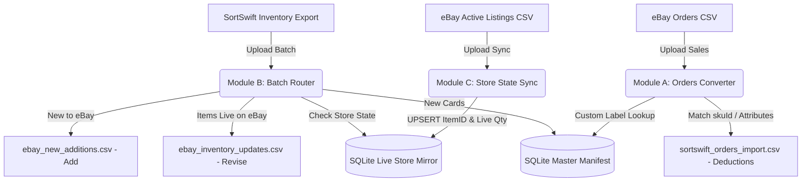

# TCG Card Inventory Middleware (SortSwift &harr; eBay Bridge)

A lightweight, containerized Python web application and standalone core library designed to run on a **Synology NAS** (via Docker / Container Manager) and developable directly on **Windows**.

This middleware connects **SortSwift** (TCGplayer Inventory Schema) and **eBay Seller Hub Reports**. It automates stock deductions, synchronizes single/variation listings, and bypasses eBay's 50-character SKU limit using an atomic SQLite database and compact sequential manifest IDs (`ID1001`, `ID1002`, ...).

---

## 📑 System Architecture & Workflow



---

## 🔐 Authentication: Google Sign-In Only

This application authenticates **exclusively through Google Sign-In**. There is no local username/password login and no development bypass, so there is exactly one way to become an authenticated user.

* **First User Auto-Admin**: The very first Google account to sign in is automatically granted the `admin` role and `active` status.
* **Admin Approval Required**: Every subsequent account lands in `pending` status and cannot process inventory until an admin approves it.
* **Admin Control Panel**: Sign in as the admin and click **"Users & Approvals"** in the top navigation bar to approve pending accounts, deactivate users, or promote users to admin.
* **Stable Identity**: Accounts are keyed on the Google `sub` claim, not the email address, so a user changing their Google email keeps the same local account and approval state.
* **`GOOGLE_CLIENT_ID` is required.** The app refuses to start without it rather than booting into a state where nobody can sign in.

### ⚠️ Google will not authorize a bare LAN address

Google requires OAuth JavaScript origins to use **HTTPS** and **rejects raw IP addresses**. The only exception is `localhost`. That means:

| Origin | Allowed? |
|---|---|
| `http://192.168.1.50:8080` | ❌ Never — raw IP and plain HTTP |
| `http://tcg.local:8080` | ❌ Plain HTTP, non-localhost |
| `http://localhost:8080` | ✅ The one plain-HTTP exception |
| `https://cards.yourname.synology.me` | ✅ Recommended for the NAS (see Step 2) |

So reaching the dashboard on your NAS requires an HTTPS hostname in front of the container. The setup is walked through below.

### Step 1 - Create the Google OAuth client

Google reorganized these screens into the **Google Auth Platform**; the old
"APIs & Services > OAuth consent screen" menu item no longer exists.

1. Go to <https://console.cloud.google.com> and create or select a project
   (the project name is internal and never shown to users).
2. In the left nav open **APIs & Services > OAuth consent screen**, which now
   lands on **Google Auth Platform**. If the project has never been configured,
   click **Get started**. Otherwise use the tabs described below. Direct link:
   <https://console.cloud.google.com/auth/overview>
3. **Branding** tab - set the **App name** (this is what users see on the
   consent screen, e.g. "TCG Inventory Middleware") and the **User support
   email**. Everything else on this tab is optional.
4. **Audience** tab - set the user type to **External**, and fill in the
   **Developer contact information** email if prompted.
   * While the app is in *Testing*, only accounts you list under **Test users**
     can sign in. Add your own Google account there.
   * Click **Publish app** to lift that restriction. With only the basic scopes
     below, publishing needs no Google review.
5. **Data Access** tab - click **Add or remove scopes** and select only
   `openid`, `.../auth/userinfo.email` and `.../auth/userinfo.profile`. These
   are non-sensitive, so Google does **not** require app verification.
6. **Clients** tab - click **Create client**. Direct link:
   <https://console.cloud.google.com/auth/clients>
   * **Application type**: `Web application`
   * **Name**: anything, e.g. "TCG Middleware Web"
7. Under **Authorized JavaScript origins**, click **Add URI** for each of:
   * `https://cards.yourname.synology.me` - production (scheme + host, no
     path, no trailing slash, no `:443`)
   * `http://localhost:8080` - Windows development
   * `http://localhost` - optional, harmless, avoids port surprises
8. Leave **Authorized redirect URIs empty.** The Google Identity Services
   button returns the credential to the page via `postMessage`, not an HTTP
   redirect. Adding one here is the single most common source of confusion.
9. Click **Create**. Copy the **Client ID** (it looks like
   `1234567890-abc123def456.apps.googleusercontent.com`) into your `.env`:
   ```bash
   GOOGLE_CLIENT_ID=1234567890-abc123def456.apps.googleusercontent.com
   ```
   There is **no client secret** in this flow. Google shows one, but this app
   does not use it. The Client ID alone is sufficient and is safe to expose in
   the browser.
10. Restart the app. Origin changes can take anywhere from 5 minutes to a few
    hours to propagate, so a fresh origin may be rejected briefly.

**Troubleshooting**

| Symptom | Cause |
|---|---|
| `Error 400: redirect_uri_mismatch` | You added a redirect URI. Remove it; this flow does not use one. |
| `The given origin is not allowed for the given client ID` | The browser's address bar does not exactly match an authorized origin (scheme, host and port must all match), or the change has not propagated yet. |
| Button does not render at all | `GOOGLE_CLIENT_ID` is unset or wrong, or the page cannot reach `accounts.google.com`. The dashboard shows an explanatory panel in this case. |
| `Access blocked: app has not completed verification` | The app is still in *Testing* and your account is not listed under **Audience > Test users**. |
| One Tap prompt never appears on `http://localhost` | Expected: One Tap requires HTTPS. The standard sign-in button still works. |

### Step 2 - Put HTTPS in front of the container (Synology)

Give the app **its own subdomain** rather than serving it on the bare DDNS
hostname. Synology resolves any subdomain of your DDNS name to the same NAS, so
`cards.yourname.synology.me` works with no extra DNS configuration.

This is not just cosmetic. All of this app's requests are rooted at `/`
(`/static/app.js`, `/api/...`), so a path-based proxy rule such as
`/cards/ -> localhost:8080` would break every asset and API call. Host-based
routing on a subdomain needs no rewriting. It also keeps the app on its own
browser origin, so its session cookie is not shared with DSM's own web UI or
any other reverse-proxied service on the NAS.

1. **Control Panel > External Access > DDNS** - add a Synology-provided
   hostname, e.g. `yourname.synology.me`. You register only this one name; the
   subdomain below needs no separate registration.
2. **Control Panel > Security > Certificate > Add > Add a new certificate >
   Get a certificate from Let's Encrypt**, then:
   * **Domain name**: `yourname.synology.me`
   * **Subject Alternative Name**: `*.yourname.synology.me`

   The wildcard SAN covers the bare hostname *and* every subdomain, so one
   certificate serves this app and anything else you host later, with a single
   renewal. Wildcard issuance is supported for Synology DDNS domains
   specifically; it is not available through the wizard for custom domains.
3. **Control Panel > Login Portal > Advanced > Reverse Proxy > Create**:
   * Source: `HTTPS` / `cards.yourname.synology.me` / port `443`
   * Destination: `HTTP` / `localhost` / port `8080`
   * On the **Custom Header** tab, use **Create > WebSocket** if you later add
     any streaming endpoints. Not required today.
4. Set the certificate for that subdomain under **Control Panel > Security >
   Certificate > Settings**, pointing `cards.yourname.synology.me` at the
   wildcard certificate.
5. Keep `COOKIE_SECURE=true` in the NAS `.env`. DSM terminates TLS; the
   container keeps serving plain HTTP internally on `8080`.
6. Register the subdomain as the authorized JavaScript origin in Google Cloud
   Console - **exactly** `https://cards.yourname.synology.me`, with no port and
   no trailing slash. Origins are matched exactly, so the bare
   `https://yourname.synology.me` is a *different* origin and would be
   rejected. Register both only if you intend to browse to both.

---

## 🐳 Synology NAS Deployment Guide

### 1. Requirements on Synology NAS
* Synology DSM 7.2+ with **Container Manager** (or Docker on DSM 7.0/7.1).
* SSH or File Station access.
* An HTTPS hostname reachable by your browser (see Step 2 above).

### 2. Deployment Steps via Docker Compose
1. Create a directory on your NAS for persistent data:
   ```bash
   mkdir -p /volume1/docker/tcg-middleware/data
   chmod -R 777 /volume1/docker/tcg-middleware/data
   ```
2. On your local machine, push your changes to GitHub:
   ```bash
   git add .
   git commit -m "Deploy latest changes"
   git push origin main
   ```
3. On your Synology NAS (via SSH or Container Manager Web UI):
   ```bash
   cd /volume1/docker/tcg-middleware
   git pull origin main
   docker-compose up -d --build
   ```
4. Access the dashboard at `https://cards.yourname.synology.me`.

`docker-compose` will refuse to start if `GOOGLE_CLIENT_ID` is not set in the environment or `.env`.

### 3. Avoiding Port Conflicts on Synology
If port `8080` is already used by another container on your NAS, set `HOST_PORT` in your `.env`:
```bash
HOST_PORT=8088
```
The container maps host port `8088` to container internal port `8080`. Point the reverse-proxy destination at whichever host port you chose.

### 4. Health Checks
The container exposes an unauthenticated probe at `/api/health`, which also verifies the SQLite volume is reachable and returns `503` if it is not. A Docker `HEALTHCHECK` is wired to it, so Container Manager shows the container as healthy or unhealthy rather than merely running.

---

## 💻 Windows Local Development & Testing Cycle

### 1. Setup Virtual Environment
```powershell
python -m venv .venv
.\.venv\Scripts\Activate.ps1
pip install -r requirements.txt
```

### 2. Configure `.env`
Copy `.env.example` to `.env`, then set your Client ID and relax the cookie flag for plain HTTP:
```bash
GOOGLE_CLIENT_ID=<your-id>.apps.googleusercontent.com
COOKIE_SECURE=false
```
Make sure `http://localhost:8080` is registered as an authorized JavaScript origin.

### 3. Run Locally on Windows
```powershell
python app/main.py
```
Open `http://localhost:8080`. Browsing via `http://127.0.0.1:8080` also works, but whichever form you use must match an authorized origin exactly.

### 4. Run Automated Tests
```powershell
# Run standalone engine unit tests
python -m unittest discover -s tcg_engine/tests

# Run web app & API integration tests
python -m unittest tests/test_web_app.py
```
The web tests stub Google token verification, so they need no network access and no real credentials.

---

## 📦 Standalone Core Package (`tcg-engine`) & CLI

The core business logic is packaged as an independent library in [`tcg_engine/`](./tcg_engine) with zero web dependencies.

### Running Standalone via CLI:
```powershell
# Initialize SQLite database
python -m tcg_engine.cli init-db --db data/inventory.db

# Module A: Convert eBay Orders CSV to SortSwift Deduction CSV
python -m tcg_engine.cli orders sample_ebay_orders.csv -o sortswift_orders.csv --db data/inventory.db

# Module B: Route SortSwift Batch to eBay Add vs. Revise CSVs
python -m tcg_engine.cli batch sortswift_batch.csv --out-dir ./output --db data/inventory.db

# Module B: Re-apply a batch that has already been processed (adds quantities again)
python -m tcg_engine.cli batch sortswift_batch.csv --out-dir ./output --force --db data/inventory.db

# Module C: Sync Active eBay Listings Report into Store State Mirror
python -m tcg_engine.cli sync active_listings.csv --db data/inventory.db

# Export Master Catalog
python -m tcg_engine.cli export-manifest -o master_manifest.csv --db data/inventory.db
```

---

## 💰 Configurable Tiered Pricing Rules

Pricing is driven entirely by the rules stored in the `pricing_rules` table, which you edit from the **Pricing Rules** screen on the dashboard. **The database is the source of truth** — the figures below are only the defaults the app ships with, and they stop being accurate the moment you edit a tier.

* **Rule Types Supported**:
  1. **Fixed Base Price ($)** (`fixed`) — the card is listed at a flat price, ignoring its market value.
  2. **Market Price + Diff ($)** (`markup_fixed`) — adds a fixed dollar amount to the base price.
  3. **Market Price + Markup (%)** (`markup_percent`) — adds a percentage markup to the base price.
* **Shipped Default Rules**:

  | Base price range | Rule | Result |
  |---|---|---|
  | `$0.00` – `$0.25` | `fixed` 1.99 | `$1.99` |
  | `$0.25` – `$0.50` | `fixed` 2.49 | `$2.49` |
  | `$0.50` – `$1.00` | `fixed` 2.99 | `$2.99` |
  | `$1.00` and above | `markup_fixed` 3.00 | base `+ $3.00` |

* **Range semantics**: a rule matches when `min_price <= base < max_price`. A rule with an empty `max_price` is open-ended and matches everything at or above its `min_price`.
* **Interactive Calculator**: The Pricing Rules page includes a live test calculator so you can enter any base price and see the computed eBay price immediately.
* **Reset Defaults**: restores exactly the four rules in the table above.

### How the base price is chosen

This is the precedence the engine actually applies, in order:

1. If the row has a non-zero **`eBay Price`** column (`Platform Price (Ebay)`, `eBay Price`, ...), that value is used **verbatim** and the pricing rules are skipped entirely. This lets you override pricing per card from SortSwift.
2. Otherwise the base price is the row's **`Market Price`** if it is greater than zero, else its **`Price`**.
3. That base is run through the pricing rules above.
4. If no rule matches and the base is greater than zero, the base is used unchanged.
5. If nothing at all resolves, the price falls back to **`$1.99`**.

---

## 🎴 Multi-Item Variation Grouping & Single Listings

Configure how the middleware splits and titles listings via the **"Listing Rules"** button on the dashboard:

* **Automated Set Grouping** (`group_by_set`, default on): cards sharing the same expansion set **and the same condition** are grouped into a single multi-variation drop-down listing. Condition is part of the grouping key because eBay applies one `ConditionID` to an entire listing, so a set holding both NM and LP cards correctly produces two listings rather than one mislabelled listing. Turn this **off** to list every card individually regardless of price.
* **Single Listing Value Threshold** (`single_threshold`, default `$5.00`): cards whose effective calculated price is **equal to or above** the threshold are split out as **standalone Single listings**. This only applies while set grouping is on.
* **Smart 80-Character Title Formatting**:
  * Default Title: `{set_name}: Pick Your Card - {condition} - Complete Your Set`
  * `{condition}` is substituted **verbatim** from your export, so the title always matches the cards it describes.
  * **Automatic Fallback**: if the title exceeds eBay's 80-character limit, the **set name** is trimmed. The condition is never abbreviated or altered, because the title makes a factual claim about the cards.
* **Parent & Child Row Generation** in `ebay_new_additions.csv`:
  * **Parent Row**: `Relationship` is left **empty**, `RelationshipDetails = Card=Name1;Name2;...`, category `183454` (CCG Individual Cards), title, description and cover image.
  * **Child Rows**: `Relationship = Variation`, `RelationshipDetails = Card=Name1`, price, quantity, `ConditionID`, `CustomLabel` (`ID1001-Bin_A-12`) and image.
  * **Separators matter**: within one attribute eBay separates values with a semicolon; a pipe (`|`) begins a *different* attribute. A `;` or `|` appearing inside a card name is replaced with `/` so one card cannot be split into several bogus options.

---

## 🏷️ Physical Bin / Remark Location Encoding

When you export your SortSwift inventory, SortSwift includes your internal notes in the `Remarks` column (e.g. `Bin A-12`, `Box 4`, `TEF-01`):

* **Encoded into eBay Custom Label (SKU)**: when generating `ebay_new_additions.csv` and `ebay_inventory_updates.csv`, the engine formats the SKU as `ID1001-Bin_A-12` (non-alphanumeric characters become underscores, truncated to 20 characters).
* **Prints on the packing slip**: an incoming order shows `ID1001-Bin_A-12`, so you can pull the physical card from the exact bin without opening any other software.
* **Auto-Resolves in Deductions**: the orders parser extracts the base `ID1001` and retrieves the exact SortSwift `skuId` to deduct stock accurately.
* **Searchable in Dashboard**: search your catalog by bin location (e.g. `Bin A-12`) in the Live Inventory table, and sort by the Bin / Remark column.

---

## 🔁 Duplicate Batch Protection

Module B **adds** quantities to the live store mirror, because a SortSwift export represents newly scanned stock. Processing the same export twice would therefore double your eBay quantities.

To prevent that, every processed batch is fingerprinted (SHA-256 of the file contents) in the `processed_batches` table. Re-uploading a file that has already been applied is **refused**, and the dashboard asks whether you really want to proceed. Confirming re-sends the upload with `force=true`; the CLI equivalent is `--force`.

---

## 📊 CSV Schema Specifications

### 1. SortSwift Inventory Export Ingestion (Module B)
* **Input**: Fresh inventory CSV from SortSwift, or an eBay-style export with `*C:`-prefixed headers. Column matching is case-insensitive and accepts many aliases.
* **Fields Read**: `Name`, `Set`, `Condition` (NM, LP, MP, HP, DM), `Printing`, `Quantity`, `SKU Id`, `TCGplayer Id`, `Card Number`, `Set Code`, `Language`, `Remarks`, `Price`, `Market Price`, `eBay Price`, `CDN Image`, `Card Back CDN Image`, `Stock Image`, `ConditionID`.
* **Pricing**: see [How the base price is chosen](#how-the-base-price-is-chosen).
* **Condition**: both the `Condition` string and the numeric `ConditionID` are taken **verbatim from your export**. There is no translation table — the value originates in SortSwift and is destined for eBay or back into SortSwift, so interposing our own vocabulary would only create a third one that can disagree with both.
  * A row missing either value is **skipped with a warning** rather than having a condition guessed for it. If you see those warnings, re-export from SortSwift with the `ConditionID` column included.
  * One consequence: the Module A deduction CSV carries whatever string your export used (e.g. `NM`), not a normalised `Near Mint`. Matching on import is driven by `skuId` regardless.
* **A note on eBay's card ConditionIDs**: for the card categories (`183050`, `183454`, `261328`) eBay does *not* use its general used-goods scale. Ungraded cards use IDs extending **`4000`** and graded cards use IDs extending **`2750`**. So `4000` means "Ungraded", **not** "Lightly Played". The actual grade is expressed in a separate, required **Condition Descriptor** field limited to *Near Mint or Better*, *Excellent*, *Very Good* or *Poor* — which this generator does not yet emit. See the outstanding-work note below.

### ⚠️ Not yet emitted for eBay uploads

The generated `ebay_new_additions.csv` is not yet complete for a File Exchange
`Add`. Known gaps, pending a manual test listing to confirm exactly what the
category demands:

* **Condition Descriptors** — required for trading cards since early 2024.
* **Item location / postal code**, **shipping** details or a business-policy
  profile name, and a **return policy**.
* The `Price` column is emitted alongside `StartPrice`; `Price` is probably not
  a valid File Exchange field for fixed-price listings and may be ignored.
* **Output 1 (`ebay_inventory_updates.csv`)** — Revise:
  ```
  Action,Item Number,Custom Label,Quantity,Price
  ```
* **Output 2 (`ebay_new_additions.csv`)** — Add:
  ```
  Action,Category,Title,Relationship,RelationshipDetails,Description,ConditionID,StartPrice,Quantity,CustomLabel,PicURL,Format,Duration,Price
  ```

### 2. eBay Orders to SortSwift Deduction Ingestion (Module A)
* **Input**: Raw eBay Orders report (`ebay_orders.csv`). Leading metadata lines are detected and skipped.
* **Fields Read**: `Custom Label` (contains `manifest_id`), `Quantity`, `Order Number`.
* **Output (`sortswift_orders_import.csv`)**:
  ```csv
  skuId,productId,Order Number,Product Name,Set Name,Condition,Printing,Quantity
  7805758,542678,ORD-501,Deerling - 016/162,SV05: Temporal Forces,Near Mint,Normal,1
  ```
  *(Matches SortSwift's official ⭐ Recommended `skuId` deduction import specification.)*

### 3. eBay Active Listings Sync (Module C)
* **Input**: Official eBay "Active Listings" report.
* **Fields Read**: `Item number`, `Custom label (SKU)`, `Available quantity`.
* **Behavior**: Ignores empty parent rows, extracts variation/single listing item IDs and quantities, and performs atomic UPSERTs into `ebay_variations`.

---

## 📦 Quantity vs Live Stock

The Live Store Inventory table shows two counts side by side so drift is
visible at a glance:

| Column | Meaning | Written by |
|---|---|---|
| **Quantity** | Total stock **you** have catalogued for that card, accumulated across every SortSwift batch you have processed. | Module B |
| **Live Stock** | The quantity **eBay** last reported for it. | Module C (Active Listings sync) |

When the two disagree the pair is highlighted amber, with a tooltip naming both
figures. A mismatch usually means one of:

* You have processed a batch but not yet uploaded the resulting
  `ebay_inventory_updates.csv` to eBay, so eBay is behind.
* Cards have sold since your last Active Listings sync, so **eBay** is ahead
  (lower) and your catalogue is stale until you run Module C again.
* A listing was edited directly on eBay.

Both figures are included in the Master Catalog CSV export, and both columns
are sortable, so you can bring the largest discrepancies to the top.

Note that the two counts are *expected* to differ right after a batch and to
converge after an Active Listings sync. The column is a reconciliation aid, not
an error indicator.

---

## 🛡️ Persistent Storage on NAS

All master catalog cards, live eBay item links, and user accounts are saved under the mounted data volume:

* `/data/inventory.db` &rarr; Catalog, live store mirror, pricing rules, listing settings, batch fingerprints
* `/data/users.db` &rarr; User accounts & admin privileges
* `/data/.session_secret` &rarr; Auto-generated session-signing secret (only if `JWT_SECRET` is not set)

Because `/data` is mounted to `/volume1/docker/tcg-middleware`, your inventory and accounts remain intact across container updates and restarts.

The master catalog additionally enforces a unique index on the card natural key (name + set + condition + printing), and manifest IDs are allocated inside a single write transaction, so two concurrent batch uploads cannot produce duplicate or colliding catalog entries.

---

## 🎨 Offline-Friendly Front End

Tailwind CSS and the web fonts are **vendored** into `app/static/vendor/` rather than loaded from a CDN, so the dashboard renders correctly on a NAS with no outbound internet access. The only external script is Google's Identity Services client, which is required for sign-in.
